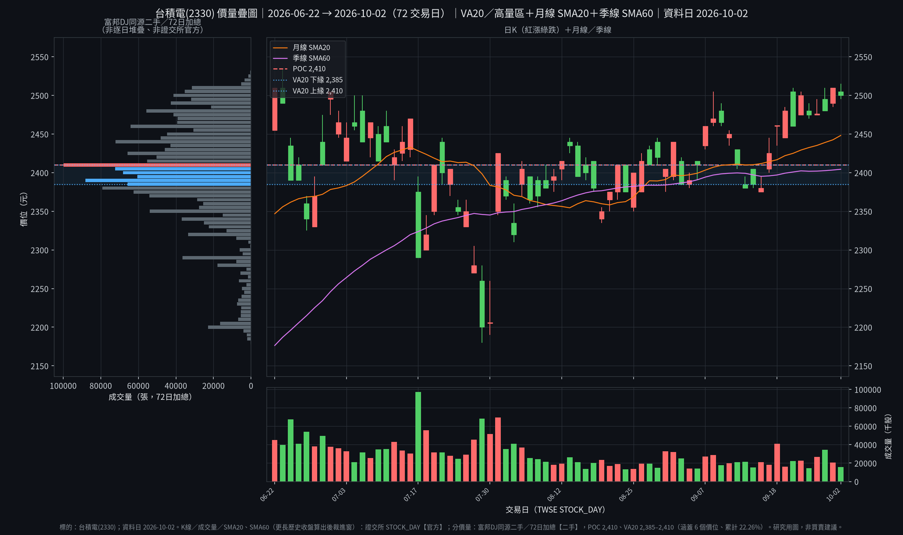

# 2330 台積電 — 投資評估報告

> 依 `methodology/workflow.md` 五階段流程執行，格式依 `methodology/09-report-format.md`。僅供學習用途，非投資建議。本版為更新報告（Update 分支：重跑階段 0、3、4、5），所有「部位建議」皆為分析師草稿，只依公開資料與 repo 方法論推導，不含任何個人持倉或資產資訊。

```
Data & Sources
  Produced:   2026-10-04
  As of:      2026-10-02 收盤（股價 NT$2,500；週日休市，這是最新完整交易日）；
              2026-06-30（最新季報 2Q26，法說 2026-07-16；3Q26 財報尚未公布）；
              2026-08（最新月營收，2026-09-10 公布；9 月營收排 2026-10-08）
  Source:     【一手：公司 IR（investor.tsmc.com）】2Q26 Management Report、合併財報（含附註）、Earnings Release、
                簡報、法說逐字稿（2026-07-16）；3Q24–1Q26 各季指引與實際；2025 年報；2026 年 1–8 月營收頁；
                Financial Calendar（9 月營收 2026-10-08 13:30、3Q26 法說 2026-10-15 14:00）
              【官方：證交所 TWSE】個股日成交資訊 2025-10 至 2026-10（STOCK_DAY）、BWIBBU 本益比/股價淨值比
                （2026-10-02）、MI_QFIIS 外資持股（2026-10-02）、T86 三大法人（2026-10-01、2026-10-02）
              【二手】富邦 DJ 分價量表 72 日（2026-06-22 至 2026-10-02）；stockanalysis.com / S&P Global
                （分析師目標價、EPS 與營收共識、beta、RSI，頁面 2026-10-02 資料、2026-10-03 更新）；
                Wisesheets 平均本益比（2026-10）；Investing.com 台灣 10 年公債殖利率 1.970%（2026-10-01）；
                經濟日報 / 中央社 / 工商時報 / TechNews 2026-10-02 至 2026-10-03 報導（摩根大通、瑞銀、凱基目標價，
                指數收盤，3Q26 法說焦點）；聯電、日月光投控 2Q26 業績報導（MoneyDJ / biggo）；
                HiStock 個股本益比月頻表（2026-10-04 重抓；2026/10 值 28.98 與證交所 2026-10-02 一致；5 年分位為自算）
              【缺件】公開資訊觀測站（MOPS）與 doc.twse：2026-10-01 診斷為封鎖，本次未重試也未繞過；
                openapi.twse.com.tw STOCK_DAY_ALL 回「安全性考量」阻擋頁，
                重試兩次仍被擋，未繞過
  來源標示定義:【一手】公司自己發布的文件：IR、法說會、財報原檔（含公司經公開資訊觀測站申報的版本）；
              【官方】交易所、主管機關的市場資料：個股日成交、三大法人、外資持股等；
              【二手】券商與資料商頁面、分析師共識、新聞、第三方彙整；
              【缺件】該取而取不到的來源。寫出被什麼擋、重試幾次；不用瀏覽器、換 IP 等方式繞過阻擋
  Retrieval:  web/tool retrieval（GitHub connector 讀 repo；curl 抓公司 IR 與 TWSE；WebSearch / WebFetch 抓二手頁面）
  Confidence: MEDIUM。損益、資產負債表、現金流、指引、年報來自公司 IR 原檔（一手）；股價、本益比、外資持股、
              法人買賣超來自證交所。內部人持股異動與重大訊息（MOPS）為缺件。分析師目標價、共識 EPS、
              平均本益比、公債殖利率為二手。市值、EV、ROIC、DCF、全年 EPS 與 FCF 為自行估算（以 ~ 標示）。
              WACC：Rf 1.97% + β 1.24 × ERP 6% + 地緣溢價 1% = Re 10.4%，負債權重~1.6%，算得~10.3%，
              報告沿用 10%（與上版一致），並在 4.2 用 9–11% 敏感度檢驗。
```

截至 2026-10-04（週日），最新一場法說仍是 2026-07-16 的 2Q26 法說。9 月營收（2026-10-08 13:30）與 3Q26 財報／法說（2026-10-15 14:00）都還沒公布，公司 IR 日曆另載 2026-10-05 至 2026-10-14 為緘默期。上一版寫入後（2026-10-02）沒有新的公司指引。

---

## 結論先講

| 項目 | 結果 |
|------|------|
| 是不是好公司？ | **是**：護城河 8.5/10（Wide，趨勢變寬）；ROIC − WACC +24 pp；淨現金 NT$24,863 億 |
| 是不是好價格？ | **略貴**：綜合內在價值 ~NT$2,330，現價 NT$2,500，安全邊際 −7% |
| 綜合分數 | **6.4 / 10**（Hold / Watch：三種方法加權後仍未達 GARP 10%） |
| 建議動作 | **觀察名單**；GARP 進場價 ≤ NT$2,100，價值進場價 ≤ NT$1,750 |
| 最大風險 | 下半年 2 奈米稀釋毛利率 3–4 pp；2026 年資本支出 US$600–640 億（匯率 32，~NT$19,200–20,480 億，自行換算）；先進製程產能仍高度集中在台灣 |

**一句話**：先進製程瓶頸還在，好公司；三種方法加權後內在價值 ~NT$2,330，現價高 ~7%，分數 6.4 落在觀察區。

---

## 關鍵數據

| 項目 | 數值 |
|------|------|
| 股價 | NT$2,500（2026-10-02 收盤，−10；證交所） |
| 市值 / EV | ~648,309 / ~623,866（EV = 市值 − 淨現金 24,863 + 非控制權益 420，自行估算） |
| 近 4 季 EPS | NT$86.27（3Q25 17.44 + 4Q25 19.50 + 1Q26 22.08 + 2Q26 27.25） |
| P/E（TTM） | 28.98x（證交所 BWIBBU 2026-10-02；自算 2,500 / 86.27 = 28.98x）。5 年中位數 23.4x（HiStock 月頻本益比表 2021-11 至 2026-10，59 個月值〔該頁缺 2023-08〕，2026-10-04 重抓；中位數為自算，二手；p25 17.2x / p75 27.4x，現值落在約第 86 百分位）；5 年平均 20.74x（Wisesheets，2026-10，二手） |
| P/B | 10.08x（證交所 2026-10-02；每股淨值 NT$248，母公司權益 64,325 / 259.32 億股） |
| EV/EBITDA | ~19.6x（EV 623,866 / TTM EBITDA ~31,801，自行估算） |
| P/FCF | ~56.7x（現價 / TTM 實際 FCF 每股 NT$44.10。TTM FCF 11,436 = 1,393.8 + 3,686.0 + 3,482.1 + 2,873.6，見 3.3） |
| 現金殖利率 | ~0.96%（2026 年每股現金股利 NT$24 / 現價，自行估算） |
| 1 年 / 今年以來報酬 | 1 年 +83.2%（2025-10-02 收盤 1,365 → 2,500）/ 今年以來 +61.3%（2025-12-31 收盤 1,550 → 2,500）。皆為證交所日收盤自算。52 週盤中區間 1,355（2025-10-02）至 2,535（2026-06-23），現價低於 52 週高點 1.4% |
| 外資持股 | 69.17%（證交所 2026-10-02；2026-10-01 為 69.19%）。外陸資 2026-10-01 買超 ~77 億、2026-10-02 賣超 ~148 億（T86 股數 × 收盤價，自行換算） |
| 流通股數 | 259.32 億股（證交所已發行 25,932,370,067 股） |

金額單位：NT$億。市值 = 259.3237 × 2,500 = 648,309，自行估算。

**營收結構（2Q26，公司 Management Report）**：HPC 66%、智慧型手機 22%、IoT 5%、車用 4%、數位消費電子 1%、其他 2%。晶圓營收：2nm 3%、3nm 30%、5nm 33%、7nm 11%，7nm 及以下 77%。地區：北美 78%、亞太 8%、中國 6%、日本 4%、歐非中東 4%。晶圓出貨 4,336 千片（12 吋約當），年增 16.6%。

**2025 年報**：Foundry 2.0 市占 40%（2024 年 34%）。前十大客戶占營收 78%（2024 年 76%、2023 年 70%）。最大客戶 19%（2024 年 22%、2023 年 25%），第二大 17%（2024 年 12%、2023 年 11%）。305 個製程、534 個客戶、12,682 個產品。

### 關鍵數據補充：價量疊圖



資料日：2026-10-02 收盤。K 線與成交量為證交所 STOCK_DAY 日資料；分價量為富邦 DJ 72 日加總表（2026-06-22 至 2026-10-02，二手，非逐日堆疊、非證交所官方）。

| 圖上項目 | 數值 | 來源 / 算法 |
|----------|------|-------------|
| 控制點 POC（成交量最大價位） | NT$2,410（99,826 張） | 富邦 DJ 72 日分價量，二手 |
| 價值區 VA20（定義：自 POC 向兩側擴張，累計成交量 ≥ 20% 的價格區間） | NT$2,385–2,410，涵蓋 6 個價位（每檔 5 元），累計 454,809 張 = 22.26%（72 日總量 2,043,222 張；分價表共 72 個價位，2,180–2,535） | 同上，自行彙整 |
| 現價相對價值區 | 2026-10-02 收盤 NT$2,500（證交所）：+3.7%（在區間上方；對 VA20 上緣 2,410） | 自算 |
| SMA20 / SMA60 | 2,448 / 2,404 | 證交所日收盤自算（以 243 個交易日歷史計算，再裁進 72 日窗顯示） |

圖例：紅漲綠跌（#ff6b6b / #51cf66）；SMA20 橘色細實線、SMA60 紫色細實線；POC 紅色虛線；VA20 上下緣藍色點線。

---

## 階段 2：快篩淘汰 ✅ 通過

| 淘汰條件 | 台積電 | 結果 |
|----------|--------|------|
| ROIC < WACC（連續 2 年以上） | ROIC 33.5% vs WACC 10%（2026-06-30 TTM，自算）。2025 年淨利 17,179 億、2024 年 EPS 45.25，獲利為正 | ✅ 目前利差為正 |
| F-Score ≤ 3 | 9 / 9（見 3.3） | ✅ |
| CFO / 淨利 < 0.7x（連續多年） | 1H26：營運現金流 14,823 / 淨利 12,790 = 1.16x | ✅ 這半年沒有低於 0.7x |
| Net Debt / EBITDA > 4x | 淨現金。有息負債 10,317 / TTM EBITDA ~31,801 = 0.32x | ✅ |
| 會計師更換、重編、持續經營疑慮 | 事務所仍為勤業眾信；簽證會計師自 2026 年起依法輪調（林尚志 → 陳彥君），不是換所。2025 年報最近兩年無非無保留意見；2Q26 財報目錄含會計師核閱報告，但該頁為影像檔，結論文字未逐字核對（列入待補）。沒有重編、沒有持續經營疑慮的記載 | ✅ |

需要深入查的標記項目：
- ⚠️ 2Q26 處分與評價世界先進(VIS)等業外利益 NT$632 億（業外收益合計 958.3 億），推升 EPS ~+2.0（稅後，632 × (1 − 18.1%) / 259.32）至 +2.4（稅前口徑），自行估算；公司未在本次取得的文件中單列此項 EPS 影響
- ⚠️ 存貨天數季增 7 天到 87 天，公司歸因 N2 爬坡；應收天數季增 3 天到 29 天。應收餘額 4,409 億，年增 87%，高於營收年增 36%（見 3.3，這項形式上觸發 03 §3 的紅旗門檻，已做深入查核）

沒有一項觸發淘汰。

---

## 階段 3：深入研究

### 3.1 生意與護城河 → 護城河分數 **8.5 / 10（Wide，趨勢變寬）**

**供應鏈位置**：中游晶圓代工。2Q26 先進製程（7nm 及以下）占晶圓營收 77%，HPC 占營收 66%。瓶頸在先進邏輯製程與先進封裝：法說說先進封裝產能緊到「限制客戶成長」；先進封裝是資本支出的 10–20%（含光罩）。

**護城河來源**

| 來源 | 證據 | 強度 |
|------|------|------|
| 技術領先 | 2nm 已占晶圓營收 3%，公司說下半年陡峭爬坡。A14 風險量產 2027、量產 2028；A13、A12 量產 2029（2Q26 法說逐字稿） | 強 |
| 轉換成本 | 魏哲家：選製程夥伴不是換便利商店，從開發到量產要五年以上，沒有捷徑 | 強 |
| 規模與客戶 | 2025 年 305 個製程、12,682 個產品、534 個客戶（2025 年報）。Foundry 2.0 市占 40%，前十大客戶 78% | 強 |
| 定價 | 2Q26 毛利率 67.7%（2Q25 58.6%）。3Q26 指引 65–67%，公司說中值 66%，比 2Q 低 1.7 pp，主因 N2 稀釋 3–4 pp | 強，但下半年會被稀釋 |

**Porter 五力（5 分代表對台積電最有利）**

| 力量 | 分數 | 說明 |
|------|------|------|
| 同業競爭 | 4 | 分析師點名三星與英特爾。公司回應仍是技術、製造、客戶信任，不認為有捷徑 |
| 新進者威脅 | 5 | 新節點開發到量產 5–7 年，資本門檻極高 |
| 供應商議價力 | 3 | 設備端（ASML EUV）擴產由公司預先協作；法說沒有看到擴產瓶頸，但也不是公司能單方面決定 |
| 買方議價力 | 3 | HPC 占 66%，最大客戶 19%、第二大 17%，客戶大；但轉換要數年，公司仍把 2026 年美元營收成長上修到略高於 40% |
| 替代品威脅 | 4 | 成熟製程：法說說只有 AI 相關（電源管理 IC、感測器）供不應求，消費性需求偏弱，不是整體缺貨。公司把成熟製程放在特殊製程，不靠通用品價格競爭 |
| **產業吸引力** | **4 / 5** | (4+5+3+3+4) / 5 = 3.8，四捨五入 4 |

**瓶頸分數**：8 / 10。先進製程占晶圓營收 77%，HPC 為 66%。公司同時在台灣未來數年建 13 座領先製程與先進封裝廠，並宣布亞利桑那再投 US$1,000 億（~NT$32,000 億，匯率 32，自行換算），累計 US$2,650 億。2026 年資本支出上修到 US$600–640 億。產能仍緊，但新廠量產年公司沒有逐廠給。

**護城河綜合分數**

| 項目 | 權重 | 分數 | 加權 |
|------|------|------|------|
| 護城河來源強度 | 25% | 9 | 2.25 |
| 持久性 | 20% | 8 | 1.60 |
| 競爭地位 | 20% | 9 | 1.80 |
| 產業吸引力 | 15% | 8 | 1.20 |
| 定價能力 | 10% | 8 | 0.80 |
| 創新定位 | 10% | 8 | 0.80 |
| **合計** | | | **8.5** |

2.25+1.60+1.80+1.20+0.80+0.80 = 8.45，記 8.5。產業吸引力 4/5 換成 8 分再乘權重。

### 3.2 財務體質 → **極佳**（ROIC − WACC +24 pp）

**成長與獲利**

| 期間 | 營收（NT$億） | YoY | 毛利率 | 營業利益率 | 淨利率 | EPS |
|------|---------------|-----|--------|------------|--------|-----|
| 2024 | 28,943 | — | 56.1% | 45.7% | 40.5% | 45.25 |
| 2025 | 38,091 | +31.6% | 59.9% | 50.8% | 45.1% | 66.25 |
| 2Q25 | 9,338 | +38.6% | 58.6% | 49.6% | 42.7% | 15.36 |
| 1Q26 | 11,341 | +35.1% | 66.2% | 58.1% | 50.5% | 22.08 |
| 2Q26 | 12,704 | +36.0% | 67.7% | 60.3% | 55.6% | 27.25 |
| 3Q26 指引 | 14,272–14,656 | +37%（美元中值） | 65–67% | 56–58% | — | — |
| 2026-08 單月 | 5,148 | +53.3% | — | — | — | — |
| 2026-01–08 | 33,869 | +39.3% | — | — | — | — |

2Q26 營收 12,703.81 億、營業利益 7,666.0 億，美元營收~US$402 億（落在該季指引高標 40.2），季增 12.0%。2026 年每月營收（NT$億，年增）：1月 4,013（+36.8%）、2月 3,177（+22.2%）、3月 4,152（+45.2%）、4月 4,107（+17.5%）、5月 4,170（+30.1%）、6月 4,427（+67.9%）、7月 4,676（+44.7%）、8月 5,148（+53.3%）。3Q26 的新台幣區間是美元指引 US$446–458 億 × 32，自行換算。

**3Q26 追蹤（自行估算，匯率沿用公司指引 32.0，實際匯率未知）**：7 月 4,676 + 8 月 5,148 = 9,824。要落在指引區間，9 月需要 ~4,448–4,832；若 9 月與 8 月持平（5,148），3Q ~14,972，折美元 ~US$468 億，高於指引上緣 US$458 億。這只是換算，不是預測；9 月營收 2026-10-08 才公布。

**營運槓桿**：營業費用占營收從 1Q26 的 8.3% 降到 2Q26 的 7.8%。營業利益率季增 2.2 pp 到 60.3%。2Q26 非營業收益 958.3 億，含世界先進(VIS)處分與評價等利益 632 億，所以稅前淨利率高於營業利益率；營業利益率比淨利率更能代表本業。

**資產負債表（2026-06-30）**

| 指標 | 數值 | 判定 |
|------|------|------|
| 現金及約當現金 | 31,342（現金及有價證券 35,180） | — |
| 有息借款 | 10,317（長期 8,643 + 一年內到期 1,674；一年內到期占 16.2%） | — |
| 淨現金 / 淨負債 | 淨現金 24,863 | ✅ |
| Net Debt / EBITDA | 淨現金。有息負債 / TTM EBITDA = 10,317 / ~31,801 = 0.32x（上一版誤用半年 EBITDA 得 0.58x，已修正） | ✅ |
| 流動比率 | 2.46x（2025-06-30 為 2.37x） | ✅ |
| 利息保障倍數 | 1H26 營業利益 14,256 / 財務成本 58（附註二二，已扣資本化利息 51.0）= 246x | ✅ |
| 商譽 / 總資產 | 59.6（5,955,445 千元）/ 93,757 = 0.06%。2025 年底減損測試折現率 9.5%，1H26 商譽累計減損為 0 | ✅ |
| 現金轉換週期（CCC） | 應收 29 天 + 存貨 87 天 − 應付 24 天 = 92 天（應付天數自行估算） | ⚠️ 應收與存貨天數都上升 |

金額來自 2Q26 Management Report 與合併財報，單位由 NT$ billion 乘 10 或由千元換成億。總資產 93,757，總負債 29,012，權益 64,745（母公司 64,325、非控制權益 420）。

**DuPont**：2Q26 ROE 45.9%（公司在法說後補記）。淨利率 55.6%。資產週轉 0.136（2Q26 營收 12,704 / 總資產 93,757，單季；年化 ~0.54）。權益乘數 93,757 / 64,745 = 1.45x。55.6% × ~0.54 × 1.45 = ~43.6%，低於公司 45.9%（公司用平均權益年化，口徑不同）。報酬主要來自利潤率，不是槓桿。

**ROIC / WACC（自行估算）**

```
TTM EBIT   3Q25 5,007 + 4Q25 5,649 + 1Q26 6,590 + 2Q26 7,666 = 24,912
有效稅率   16.2%（TTM 稅前 26,680、稅額 4,312、淨利 22,371）
NOPAT      24,912 × (1 − 16.2%) = ~20,885

投入資本   權益 64,745 + 總負債 29,012 − 現金及約當現金 31,342 = 62,415（02 的公式）
ROIC       20,885 / 62,415 = 33.5%
WACC       10%（Rf 1.97% 為 2026-10-01 的 10 年公債；β 1.24；ERP 6%；地緣溢價 1%；負債權重~1.6%）
           CAPM ~10.4%，加權後~10.3%，取 10% 與上一版一致
利差       33.5% − 10% = +23.5 pp，記 +24 pp
```

**ROIC 趨勢（同一公式，自行估算）**：2Q25 TTM ROIC ~29.6%（NOPAT ~13,748；投入資本 權益 46,167 + 負債 23,897 − 現金 23,645 = 46,419），到 2Q26 的 33.5%，利差擴大~+4 pp（WACC 以 10% 不變計）。另一口徑（權益 + 有息負債 − 現金及有價證券）投入資本 39,881，ROIC 52.4%，利差 +42 pp。報告用 02 的公式，+24 pp。兩種都高於 WACC。

### 3.3 盈餘品質 → **普通**（會計品質 **16 / 21**）

**Piotroski F-Score：9 / 9**（依 repo 定義，2Q26 對 2Q25 的單季口徑；stockanalysis 頁面顯示 8，定義不同，不採用）

比較日是 2026-06-30 對 2025-06-30，數字來自 2Q26 合併財報與 Management Report。

| # | 條件 | 結果 |
|---|------|------|
| 1 | ROA > 0 | ✅ 2Q26 淨利 7,066 / 總資產 93,757 = 7.54% |
| 2 | CFO > 0 | ✅ 2Q26 營運現金流 7,834；1H26 14,823 |
| 3 | ROA 改善 | ✅ 2Q25 同口徑 5.68% |
| 4 | CFO > 淨利 | ✅ 2Q26 CFO / 總資產 8.36% > ROA 7.54%；1H26 14,823 / 12,790 = 1.16x |
| 5 | 槓桿下降 | ✅ 長期負債 / 總資產 9.2%，一年前 12.6% |
| 6 | 流動比率改善 | ✅ 2.46x，一年前 2.37x |
| 7 | 沒有增發新股 | ✅ 股數 259,324 百萬 vs 259,326 百萬，持平 |
| 8 | 毛利率擴張 | ✅ 2Q26 67.7% vs 2Q25 58.6% |
| 9 | 資產週轉改善 | ✅ 2Q26 營收/資產 0.1355，2Q25 為 0.1333 |

| 指標 | 數值 | 判定 |
|------|------|------|
| Piotroski F-Score | 9 / 9 | ✅ |
| CFO / 淨利 | 1H26 1.16x | ✅ |
| FCF / 淨利 | 1H26 FCF 6,356 / 淨利 12,790 = 50%；TTM 11,436 / 22,371 = 51% | ⚠️ 低於 80%，原因是擴產 |
| 應收帳款成長 vs. 營收成長 | 應收 4,409 vs 一年前 2,357，+87%；2Q 營收 +36%，~2.4x，形式上觸發 03 §3 的「應收成長 > 營收成長 2 倍」紅旗。深入查核：6 月單月營收 4,427 億，年增 +67.9%（2025-06 為 2,637）；應收 / 6 月營收 = 1.00，一年前 0.89。季末單月營收占比較高，解釋大部分但不是全部差距。應收天數 29，仍低 | ❌ 形式觸發紅旗，已查核，列入 Bear 與待追蹤 |
| 存貨成長 vs. 營收成長 | 存貨 3,855 vs 一年前 3,042，+27%，低於營收增幅。天數 87，季增 7 天，公司歸因 N2 | ⚠️ 天數 |
| SBC / 營收 | 1H26 股份基礎給付 5.97（權益交割 2.37 + 現金交割 3.60，附註二六(三)）/ 營收 24,045 = 0.025% | ✅ |
| 非經常性項目 | 世界先進(VIS)處分與評價等利益 ~632（EPS ~+2.0，自算） | ⚠️ |
| 會計師、重編 | 勤業眾信核閱；核閱報告頁為影像，結論文字未逐字核對。無重編 | ✅（待補核閱結論原文） |

1H26 自由現金流 = 營運現金流 14,823 − 購置不動產廠房及設備 8,468 = 6,356。TTM 自由現金流 11,436（4 季 Management Report 的 FCF 相加）。全年 2026 FCF 自行估算：下半年營運現金流沿用上半年 14,823，全年資本支出取指引中值 US$620 億 × 32 = 19,840，得 29,646 − 19,840 = ~9,806。上一版的 P/FCF 用這個估算值（66.4x）；這版改用 TTM 實際值（56.7x），原因是 TTM 是已發生的數字。

應付天數 = 應付帳款 1,106（附註；含關係人，不含設備款 2,909）/ 2Q26 銷貨成本 4,101 × 90 = 24 天。CCC = 29 + 87 − 24 = 92 天。（上一版應付 1,089、應收 4,358 是舊值，已改成 2Q26 財報值。）

**營運資金 / 營收增量（checklist B）**：(應收 + 存貨 − 應付) 7,158 對一年前 4,551，增加 2,607；對照 2Q 營收年增量乘 4（(12,704 − 9,338) × 4 = 13,464），比率~19%，高於 15%（自行估算）。

**會計品質 16 / 21**（每項 0–3）

| 項目 | 分 | 依據 |
|------|----|------|
| 營收認列清晰度 | 3 | 平台、製程、地區都有拆 |
| Non-GAAP 調節品質 | 3 | 主表是 IFRS。世界先進(VIS)利益在法說從獲利中說明 |
| FCF 轉換率 | 1 | 1H26 只有 50%，TTM 51% |
| 營運資金趨勢 | 1 | 應收年增 87%，快於營收；ΔNWC / Δ營收 ~19% |
| 附註透明度 | 3 | 商譽測試、關係人、股份基礎給付、財務成本資本化都在附註 |
| 會計師意見 | 2 | 期中是核閱，不是年度查核；核閱結論原文未逐字核對 |
| 關係人交易 | 3 | 關係人應收 51.6，相對單季營收很小 |

3+3+1+1+3+2+3 = 16。落在 12–17，普通。

### 3.4 管理層 → **配置偏成長資本支出**（資本配置 **7.5 / 10**）

**指引可信度：8 / 8**。命中定義：該季美元營收與毛利率都落在區間內，或高於高標。來源是公司 IR 各季 Guidance 表與實際（本次逐季重新核對）。

| 季 | 營收實際 vs 指引（US$十億） | 毛利率實際 vs 指引 | 命中 |
|----|------------------------------|--------------------|------|
| 3Q24 | 23.50 vs 22.4–23.2 | 57.8% vs 53.5–55.5% | ✅ 兩項都高於高標 |
| 4Q24 | 26.88 vs 26.1–26.9 | 59.0% vs 57–59% | ✅ 都在區間內 |
| 1Q25 | 25.53 vs 25.0–25.8 | 58.8% vs 57–59% | ✅ 都在區間內 |
| 2Q25 | 30.07 vs 28.4–29.2 | 58.6% vs 57–59% | ✅ 營收高於高標，毛利率在區間內 |
| 3Q25 | 33.10 vs 31.8–33.0 | 59.5% vs 55.5–57.5% | ✅ 兩項都高於高標 |
| 4Q25 | 33.73 vs 32.2–33.4 | 62.3% vs 59–61% | ✅ 兩項都高於高標 |
| 1Q26 | 35.90 vs 34.6–35.8 | 66.2% vs 63–65% | ✅ 兩項都高於高標 |
| 2Q26 | 40.20 vs 39.0–40.2 | 67.7% vs 65.5–67.5% | ✅ 營收貼高標，毛利率高於高標 |

8/8，高於 6/8 的「強」。型態是習慣給得保守：八季裡有六季營收落在高標或高標之上。

**資本配置**
- 2026 年資本支出上修到 US$600–640 億。70–80% 先進製程、~10% 特殊製程、10–20% 先進封裝與光罩等。未來三年資本支出會比過去三年更高；2027 年數字要到 2027 年 1 月才可能給（摩根大通判斷，二手）。
- 股利：2025 年每股 NT$18，2026 年每股 NT$24（+33%，公司說 2027 年會再提高）。董事會已核准 1Q26 每股 NT$7.00，除息日 2026-09-16、發放日 2026-10-08。
- 亞利桑那再宣布 US$1,000 億，累計 US$2,650 億。台灣未來數年 13 座領先製程與先進封裝廠。
- 海外廠稀釋毛利率：初期 2–3 pp，之後 3–4 pp（公司給的數字）。
- 大型併購：這次法說沒有宣布。商譽帳面 59.6，占總資產 0.06%，1H26 沒有減損。成長來自資本支出，不是收購。

**股利安全分數：77 / 100（A）**

全年自由現金流用 TTM 實際 11,436 與 2026 年估算 9,806 兩個口徑。2026 年現金股利 = 24 × 259.32 = 6,224。

| 項目 | 數值 | 得分 |
|------|------|------|
| FCF 配發率 | 6,224 / 11,436 = 54%（用 2026E FCF 9,806 為 63%） | 20 / 25 |
| FCF 覆蓋倍數 | 11,436 / 6,224 = 1.84x（2026E 1.58x） | 15 / 20 |
| 有息負債 / EBITDA | 10,317 / TTM EBITDA ~31,801 = 0.32x | 20 / 20 |
| 盈餘穩定性 | 淨利 2021–2025：5,924 / 9,929 / 8,517 / ~11,600 / ~17,000（億，S&P，二手；2025 年公司值為 17,179）；只有 2023 一個下降年。2021–2022 損益未取一手 | 12 / 20 |
| 股利紀錄 | 2021–2025 每股股利 11 / 11 / 13 / 17 / 22（stockanalysis，二手，口徑為當年度發放），5 年無下調；更長年表未取，不給滿分 | 10 / 15 |

20+15+20+12+10 = 77。上一版 72 是因為當時只核到 2025–2026 兩個股利年，這版補到 5 年二手紀錄，且改用 TTM 實際 FCF。

資本配置 7.5 / 10：股利安全 7.7×20% = 1.54；股利成長（+33%）8×10% = 0.80；沒有庫藏股計畫，股數幾乎持平，5×20% = 1.00；併購 9×20% = 1.80；淨現金與利息保障 9×15% = 1.35；自由現金流拿去擴先進製程、ROIC 仍遠高於 WACC，7×15% = 1.05。合計 7.54，記 7.5。

**內部人與法說會語氣**：法說語氣強。C.C. Wei：對多年 AI 大趨勢的信心仍然非常高。同時把消費性與價格敏感終端列為受壓，規劃上保持謹慎。毛利率稀釋的 3–4 pp（N2）與 2–3 pp、之後 3–4 pp（海外廠）有講數字。董事長暨總裁魏哲家持股 7,217,009 股（占 0.03%，2025 年報揭露）。內部人買賣申報與重大訊息屬 MOPS，為缺件，市場訊號不用內部人買賣。

---

## 階段 4：估值與反方

### 4.1 盈餘預估

| 期間 | 假設 | EPS |
|------|------|-----|
| 2Q26 實際 | 新聞稿 | 27.25 |
| 1H26 實際 | 22.08 + 27.25 | 49.33 |
| TTM | 17.44 + 19.50 + 22.08 + 27.25 | 86.27 |
| 3Q26E | 營收中值 14,464 × 營業利益率 57% × (1 − 16.2%) / 259.32 億股。業外當 0。自行估算 | ~26.6 |
| 4Q26E | 營收再季增 5%、營業利益率 56%，同一稅率。公司沒有給 4Q 指引。自行估算 | ~27.5 |
| 2026E 自行估算 | 49.33 + 26.6 + 27.5 | ~103.5 |
| 2026E 共識 | S&P Global，35 位分析師，2026-10-02。區間 98.40–113.38（二手） | 107.89 |
| 2027E 共識 | 同一來源，由 107.89 增至 143.19（+32.7%） | 143.19 |

自行估算 3Q 用指引中值；9 月營收若持平 8 月，3Q 會高於指引上緣（見 3.2），所以自估偏保守，上檔風險在營收端。

| 本益比 | 數值 |
|--------|------|
| TTM | 28.98x |
| 2026E 共識 | 23.2x（2,500 / 107.89） |
| 2027E 共識 | 17.5x（2,500 / 143.19） |
| PEG | 23.2 / 32.7 = 0.71（2026E 本益比 ÷ 2027E 共識成長率） |

### 4.2 DCF（NT$億，基本情境）

**假設（自行估算）**：2025 年美元營收 US$1,224 億 × (1 + 40%) = 2026E US$1,714 億（公司指引「略高於 40%」）；匯率 32，換成營收 54,844。第 2 年營收成長取共識 2027E / 2026E 營收（73,300 億 / 54,400 億，二手）的 +34.7%，第 3–10 年成長 22% / 16% / 12% / 9% / 7% / 5% / 3.5% / 2%（自行遞減至接近永續成長）。FCF 利潤率從 26%（1H26 實際 6,356 / 24,045）每年 +1 pp，上限 32%。FCF 已扣股份基礎給付（real FCF = FCF − SBC，SBC 取 0.025% 營收）。WACC 10%，永續成長 2.0%（05 的 Base）。淨現金 24,863，扣非控制權益 420。股數 259.32 億。

| 年 | 營收 | 成長 | FCF 利潤率 | FCF | 現值 |
|----|------|------|------------|-----|------|
| 1 | 54,844 | — | 26% | 14,246 | 12,951 |
| 2 | 73,898 | 34.7% | 27% | 19,934 | 16,474 |
| 3 | 90,156 | 22.0% | 28% | 25,221 | 18,949 |
| 4 | 104,581 | 16.0% | 29% | 30,302 | 20,697 |
| 5 | 117,131 | 12.0% | 30% | 35,110 | 21,801 |
| 6 | 127,673 | 9.0% | 31% | 39,547 | 22,323 |
| 7 | 136,610 | 7.0% | 32% | 43,681 | 22,415 |
| 8 | 143,440 | 5.0% | 32% | 45,865 | 21,396 |
| 9 | 148,461 | 3.5% | 32% | 47,470 | 20,132 |
| 10 | 151,430 | 2.0% | 32% | 48,420 | 18,668 |

```
FCF 現值合計          195,806
終值 = 48,420 × 1.02 / (10% − 2.0%) = 617,351 → 現值 238,016（占 EV 54.9%，低於 75% 上限）
EV                    433,822
+ 淨現金               24,863
− 非控制權益              420
股權價值              458,265 ÷ 259.32 億股 = ~NT$1,767 / 股
```

**敏感度表（Base，每股 NT$）**

| WACC \ 永續成長 g | 2.0% | 2.5% | 3.0% |
|------|------|------|------|
| 9% | 2,039 | 2,134 | 2,244 |
| 10% | **1,767** | 1,833 | 1,909 |
| 11% | 1,557 | 1,604 | 1,658 |

九格都低於現價 NT$2,500（最高 2,244）。單看 Base 情境，沒有任何一格有安全邊際。

**反向 DCF**：維持 WACC 10%、g 2.0%、FCF 利潤率路徑不變，要讓 DCF 等於現價 NT$2,500，第 2–10 年營收需要每年成長~18.8%（常數，自行試算）；第 10 年營收 ~257,800 億，對照 Base 的 151,430 億。也就是現價隱含的是「比共識前兩年更慢、但之後幾年不衰減」的成長，或更低的折現率（WACC 9%、g 3% ~2,244，仍不到 2,500）。這是市場已在為更長的成長期付價的訊號。

**交叉檢查**：上一版的保守成長路徑（第 2–5 年 15%、第 6–10 年 8%）在本模型下，g 3% 得 1,721（與上一版 1,720 吻合，驗證模型複製），g 2.0% 得 1,589。上一版 DCF 的成長假設低於共識，且 g 取 3%（05 的 Base 為 2.0%）；這版改為共識錨定與 05 的 g。

### 4.3 三情境

| 情境 | 機率 | 關鍵假設 | 每股價值 |
|------|------|----------|----------|
| Bull | 20% | 2026 美元營收 +45%；其後成長 40 / 28 / 20 / 15 / 12 / 10 / 8 / 6 / 4%；FCF 利潤率 26% 起每年 +2 pp，上限 34%；WACC 9%；g 2.5% | ~2,937 |
| Base | 60% | 4.2，WACC 10%，g 2.0% | ~1,767 |
| Bear | 20% | 2026 同 Base，2027 年營收持平，其後每年 +8%；FCF 利潤率停在 22%；WACC 11%；g 1.5% | ~765 |
| **機率加權** | | 0.2×2,937 + 0.6×1,767 + 0.2×765 | **~1,801** |

三情境的 g（2.5 / 2.0 / 1.5%）與 WACC（9 / 10 / 11%）依 05 的 Bull / Base / Bear 設定。Base 的成長錨定共識，故比上一版 Base（1,720）略高。

### 4.4 足球場圖與安全邊際

| 方法 | 低 | 中 | 高 | 權重 |
|------|----|----|----|------|
| DCF（4.3 機率加權當中值） | 765 | 1,801 | 2,937 | 50% |
| P/E（共識 EPS × 五年平均 20.74x） | 2,041 | 2,604 | 2,970 | 30% |
| 分析師目標價（S&P，35 位，2026-10-02，二手） | 2,650 | 3,247 | 4,200 | 20% |
| **綜合內在價值** | | **~2,330** | | |

P/E 低 = 2026E 低標 98.40 × 20.74。中 = (107.89 + 143.19) / 2 × 20.74。高 = 2027E 143.19 × 20.74。五年平均本益比 20.74x 來自 Wisesheets（二手，2026-10）。分析師目標價中位數 3,200。未納入的方法：同業倍數（聯電(2303)、日月光投控(3711) 與台積電(2330) 業務不可比，權重 0）；EV/EBITDA 歷史區間（無來源，權重 0）；52 週區間 1,355–2,535 只作參考，權重 0。P/E 與分析師目標價都源自同一份共識 EPS，兩條腿不獨立，不能當作互相驗證。

```
0.50×1,801 + 0.30×2,604 + 0.20×3,247 = 900.5 + 781.2 + 649.4 = ~2,331，記 ~2,330
安全邊際 = (2,330 − 2,500) / 2,330 = −7%
風險報酬比 = Bull 上檔 +17.5%（NT$2,937） / Bear 下檔 −69.4%（NT$765） = 0.25 : 1 → ❌（門檻 3 : 1）
```

GARP 進場價 = 2,330 × 0.9 = NT$2,097，記 NT$2,100。價值進場價 = 2,330 × 0.75 = NT$1,747.5，記 NT$1,750。成長型進場價 = NT$2,330。

### 4.5 Bear Case → 強度 **4.5 / 10（中等偏低）**

| 支柱 | 分數 | 論點 |
|------|------|------|
| 估值過高 | 1.0 / 2 | TTM 28.98x，高於五年平均 20.74x ~40%。現價比三種方法加權值高 ~7%，反向 DCF 需要 18.8% 的長期成長 |
| 基本面惡化 | 0.8 / 2 | 3Q 毛利率指引中值 66%，比 2Q 的 67.7% 低。下半年 N2 稀釋 3–4 pp；海外廠初期再稀釋 2–3 pp，後期 3–4 pp。存貨天數 87 |
| 會計紅旗 | 0.4 / 2 | EPS 含世界先進(VIS)等利益 632 億。1H26 自由現金流只有淨利的 50%。應收年增 87%（形式觸發 03 紅旗，已查核） |
| 競爭與長期威脅 | 1.2 / 2 | 消費性終端轉弱。產能仍以台灣為主（未來數年 13 座廠在台灣）。最大客戶 19%、第二大 17%，前十大 78%。關稅與出口管制風險載於 2025 年報風險因素 |
| 管理層 | 0.5 / 1 | 資本支出上修與亞利桑那 US$1,000 億沒有附報酬率。CEO 持股 0.03%，薪酬與 ROIC / FCF 的連結本次未逐項核對 |
| 催化劑 | 0.6 / 1 | 2026-10-08 九月營收、2026-10-15 法說。若全年成長或資本支出下修，空頭會強化 |
| **合計** | **4.5 / 10** | 1.0 + 0.8 + 0.4 + 1.2 + 0.5 + 0.6 |

**空頭目標價與下檔**：空頭目標價 = 4.3 的 Bear 情境 ~NT$765（下檔 −69.4%）。基本面底部：淨現金 24,863 億，每股 ~NT$96；每股淨值 NT$248（母公司權益 64,325 / 259.32 億股）。這兩個底部都遠低於現價，所以 Bear 的下檔主要是倍數與成長預期壓縮，不是資產價值受損。

**Thesis-Killers（推翻空頭論點的條件）**
- 3Q26 毛利率落在指引上半段（≥ 66%），且 4Q 指引維持 ≥ 65%：推翻「N2 稀釋把毛利率往下拉」
- 7–9 月合計高於 US$458 億（指引上緣），且 2026-10-15 法說維持或上調「2026 美元營收略高於 +40%」：推翻「成長減速」
- 3Q26 應收天數回到 ≤ 26 天（2Q26 為 29 天）、FCF / 淨利回到 ≥ 60%（TTM 51%）：推翻會計與營運資金紅旗
- 2027 年資本支出指引附上與 ROIC 一致的報酬說明，且 ROIC − WACC 利差維持 ≥ +20 pp：推翻「擴產沒有附報酬率」

**最強的多頭反駁，以及為什麼仍不同意**：最強的反駁是 8/8 指引命中、2Q26 毛利率 67.7% 比一年前高 9.1 pp、法說上修全年成長與資本支出。承認基本面證據強；不同意的是價格——現價已反映 18.8% 的長期營收成長，單看 Base 情境九格敏感度都低於現價，所以空頭論點的核心是安全邊際，不是生意品質。

注意：`workflow.md` 規定「Bear Case 強度 ≤ 4.0 才繼續」，這裡是 4.5，未通過該門檻。這版與上一版一樣仍完成後續階段，是因為這是既有標的的更新報告；此項列在 5.2 F 區為 ❌，並在 `自查結果.md` 揭露。

### 4.6 題材熱度（08 §9）

| 觀察項 | 狀態 |
|--------|------|
| 股價漲幅 vs. EPS 上修 | 🟡 1 年股價 +83.2%。近四季 EPS 86.27，對一年前四季 56.29，盈餘 +53%。股價跑得比盈餘快，但 2026E 共識較 2025 年 EPS 66.25 仍高 +63% |
| 媒體 | 🟡 2026-10-02 台股加權指數收 48,475.74（+122.25）創收盤新高，成交 8,981.74 億；台積電收 2,500（−10）。外資在法說前調高目標價（摩根大通 3,200 → 3,300；瑞銀 3,650 維持；凱基 3,200） |
| 股價波動 | 🟡 已實現波動率 20 日 ~16.7%、60 日 ~34%（年化，證交所日收盤自算；60 日值含 2026-07-31 單日 +10%）。08 §9 沒有明訂波動率門檻，僅列參考 |
| 機構持股 | 🟡 外資 69.17%（2026-10-02）。2026-10-01 外陸資買超 ~77 億，2026-10-02 賣超 ~148 億，方向翻轉 |
| 分析師 | 🟡 目標價中位數 NT$3,200、平均 NT$3,247（35 位，2026-10-02，二手），最低 2,650，全部高於現價 |

**🔴 共 0 項（門檻 5 項）。題材生命週期判斷：擴散。**

沒有單項打成 🔴。生命週期落在擴散期：股價漲得比盈餘快，但共識 EPS 仍在追。不把題材打成過熱。

---

## 階段 5：決策

### 5.1 綜合評分

| 階段 | 權重 | 分數 | 依據 |
|------|------|------|------|
| 商業品質 | 25% | 8.8 | 護城河 8.5 與財務體質 9.0 的平均。9.0 來自 ROIC 利差 +24 pp、淨現金、流動比率 2.5x；FCF 轉換與營運資金趨勢是扣分項 |
| 估值 | 25% | 4.3 | 安全邊際 −7%，風險報酬比 0.25 : 1。評分規則：合理價 5.0 分，溢價每 1% 扣 0.1（5.0 + 0.10 × (−7.3) = 4.27）。上一版 4.5 是判斷值 |
| 市場訊號 | 20% | 6.5 | 法說上修全年美元成長與資本支出，語氣強。外資 69.17%，2026-10-01 買超後 2026-10-02 賣超。目標價全部高於現價。內部人買賣申報（MOPS）為缺件 |
| 技術面 | 15% | 7.0 | 2026-10-02 收盤 NT$2,500 在 SMA20 2,448、SMA60 2,404 之上，也高於 72 日價值區 VA20 上緣 2,410（POC 2,410）；RSI 60.4（stockanalysis，二手）；距 52 週高點 −1.4% |
| 風險 | 15% | 5.0 | Bear 強度 4.5。產能集中與毛利率稀釋還在 |
| **綜合** | | **6.4** | 8.8×0.25 + 4.3×0.25 + 6.5×0.20 + 7.0×0.15 + 5.0×0.15 = 6.375，四捨五入記 6.4 |

6.4 落在 07 的 5.0–6.4，對應 Hold / Watch（未達 ≥ 6.5 且安全邊際達標的買進門檻）。6.375 不進位的話是 6.3，兩者都在觀察區。**觀察名單**。上一版寫 6.3，但其自己的加總是 6.425，應記 6.4，這版一併更正。

訊號衝突：商業品質 8.8，估值 4.3。基本面優先，所以不因品質高而把進場價抬到現價。

### 5.2 檢核表彙整（checklist A–G）

未驗證的項目計入 ⚠️，不計 ✅。❌ 代表觸及 repo 明訂的紅旗或明確不達門檻；⚠️ 代表未達理想門檻但非紅旗，或證據不全。

| 區 | ✅ | ⚠️ | ❌ | 關鍵未過項目 |
|----|----|----|----|--------------|
| A 生意（6 項） | 4 | 1 | 1 | 最大客戶 19%、第二大 17%，單一客戶 < 10% 未過 ❌。Foundry 2.0 市占 34% → 40%，只有兩個年度，3 年趨勢證據不足 ⚠️ |
| B 財務（7 項） | 5 | 2 | 0 | CCC 92 天且上升 ⚠️。營運資金增量 / 營收增量 ~19%，高於 15% ⚠️。ROIC 利差 29.6% → 33.5% 擴大、淨現金、利息保障 246x 已核 |
| C 盈餘品質（8 項） | 5 | 2 | 1 | 應收年增 87% 是營收年增 36% 的 ~2.4x，觸及紅旗 ❌（已查核，見 3.3）。FCF / 淨利 51% ⚠️。會計品質 16 / 21 ⚠️ |
| D 管理層（7 項） | 4 | 2 | 1 | CEO 持股 0.03% < 3% ❌。內部人買賣申報為缺件 ⚠️；薪酬連結 ROIC / FCF 未逐項核對 ⚠️。指引 8/8、資本配置 7.5 ✅ |
| E 價格（5 項） | 3 | 0 | 2 | 安全邊際 −7%，未達 GARP 10% ❌。風險報酬比 0.25 : 1 ❌。終值占 EV 54.9%、PEG 0.71、多方法交叉 ✅ |
| F 風險（4 項） | 3 | 0 | 1 | Bear 強度 4.5 > 4.0 ❌。三個量化下檔風險、論點失效條件、一年內到期債 16.2% ✅ |
| G 題材股（6 項） | 4 | 2 | 0 | 瓶頸 8 / 10、熱度 0 項 🔴、已寫 KPI ✅。利潤是否往這一層集中、EPS 上修是否追得上股價 ⚠️ |

A 6 + B 7 + C 8 + D 7 + E 5 + F 4 + G 6 = 43 項。

### 5.3 進場參考價與部位（以綜合內在價值 ~NT$2,330 為準）

| 風格 | 安全邊際要求 | 進場價 |
|------|----------------|--------|
| 價值 | 25% | ≤ NT$1,750 |
| GARP | 10% | ≤ NT$2,100 |
| 成長 | 0% | ≤ NT$2,330 |

**部位建議（分析師草稿，依 09 的格式與公開資料推導，不含任何個人持倉或資產資訊）**：高信心 5–7% / 中等 2–4% / 試單 1–2% / **不建倉**（擇一附理由）→ **不建倉**。理由：現價 NT$2,500 高於成長型進場價 ~NT$2,330；安全邊際 −7% 未達最低要求；風險報酬比 0.25 : 1 低於 3 : 1；綜合 6.4 未達 6.5；Bear 強度 4.5 未過 workflow 的 4.0 門檻。在進場價表任一檔被觸及前，維持觀察。

**最關鍵的變數**：2026-10-15 法說是否維持「2026 美元營收略高於 +40%」，以及 3Q 毛利率是否落在 65–67%。下修會直接打到現在的商業品質分。

### 5.4 論點與 KPI

**論點**：台積電是先進製程的瓶頸，2Q26 與 7–8 月營收支持需求，品質上是好公司；但現價已高於三種方法加權的內在價值，這次證據不足以把價格當成好價格。等法說把毛利率與全年成長講定，或價格回到進場價表任一檔，再重新評估。

| KPI | 門檻 | 來源 | 目前 | 狀態 |
|-----|------|------|------|------|
| 3Q26 美元營收 | US$446–458 億 | 2026-07-16 指引 | 未結算。7–8 月合計 NT$9,824 億（9 月需 ~4,448–4,832 才落在區間，自行換算） | ⚠️ |
| 3Q26 毛利率 | 65–67% | 2026-07-16 指引 | 未公布 | ⚠️ |
| 2026 美元營收成長 | 維持略高於 +40% | 2026-07-16 法說 | 尚未下修。1–8 月台幣營收 +39.3%，口徑不同 | ⚠️ |
| 存貨天數 | 不再高於 87 天且公司不再歸因備貨失控 | 2Q26 法說 | 87 天 | ⚠️ |
| 估值 KPI：現價 ≤ 綜合內在價值 | ≤ ~NT$2,330（安全邊際 ≥ 0%） | 4.4 | NT$2,500，安全邊際 −7% | ❌ |

**論點失效條件**
- 上表 2 個以上 KPI 跌破門檻 → 出場（目前為觀察名單，即移出觀察名單並重跑）
- 2026-10-15 法說把全年美元成長改成低於 40%，或把 2026 年資本支出上修但毛利率指引再降超過 2 pp
- 看多時（若日後轉為買進）：F-Score 跌破 7，或 ROIC − WACC 利差跌破 +15 pp
- 看空時（目前觀察名單的空方論點）：現價回到 ≤ NT$2,100（GARP 進場價），或 3Q26 毛利率與全年成長都落在上方 Thesis-Killers 條件內

### 5.5 催化劑與重跑條件

| 日期 | 事件 | 要看什麼 |
|------|------|----------|
| 2026-10-08 13:30 | 9 月營收（公司 IR 日曆） | 7–9 月能否對上 3Q 美元指引。9 月需 ~4,448–4,832 億；持平 8 月則 3Q 超出指引上緣（自行換算） |
| 2026-10-08 | 1Q26 現金股利發放（每股 NT$7.00） | 已核准，不是新資訊 |
| 2026-10-15 14:00（台北） | 3Q26 法說（公司 IR 日曆） | 毛利率、4Q 指引、全年成長是否仍略高於 40%、2027 資本支出、美國德州第二園區傳聞（二手）、2027 價格調整。緘默期 2026-10-05 至 2026-10-14 |
| 2026-11-10 / 2026-12-10 | 10 月 / 11 月營收（公司 IR 日曆） | 4Q26 動能 |

**重跑條件**：2026-10-15 法說、股價 ±15%（低於 NT$2,125 或高於 NT$2,875）、滿 90 天（2026-12-31，自 As of 2026-10-02 起算）。維持 90 天不縮成 60 天：下一個硬資料點就是 10 月 8 日與 10 月 15 日，先等這兩個。

### 5.6 Investment Signal

```
╔══════════════════════════════════════════════╗
║              INVESTMENT SIGNAL               ║
╠══════════════════════════════════════════════╣
║ Signal:      NEUTRAL                         ║
║ Confidence:  MEDIUM                          ║
║ Horizon:     LONG-TERM                       ║
║ Score:       6.4 / 10                        ║
╠══════════════════════════════════════════════╣
║ Action:      WATCH                           ║
║ Conviction:  MODERATE                        ║
╚══════════════════════════════════════════════╝
```

商業品質偏多，安全邊際 −7%，所以訊號用中性、動作用觀察，不把 6.4 寫成買進。

---

## 同業比較

比較對象：本檔就是 2330，依 09 改比同產業 2 檔（聯電(2303)、日月光投控(3711)）。護城河、ROIC、安全邊際、Bear 強度、綜合分數要各自跑完 workflow 才有分數，這次沒有跑，也不引用舊報告，欄位標「未評估」。

| 項目 | 2330 台積電（本檔） | 2303 聯電 | 3711 日月光投控 |
|------|---------------------|-----------|-----------------|
| 護城河 | 8.5 / 10 | 未評估 | 未評估 |
| ROIC − WACC | +24 pp | 未評估 | 未評估 |
| 毛利率（2Q26） | 67.7% | 32.5% | 21.0%（合併） |
| 淨現金 / 淨負債（NT$億） | 淨現金 24,863 | 未評估 | 未評估 |
| FCF（NT$億） | TTM 11,436 | 未評估 | 未評估 |
| P/E（TTM，證交所 2026-10-02） | 28.98x | 24.29x | 51.59x |
| 安全邊際 | −7% | 未評估 | 未評估 |
| Bear 強度 | 4.5 / 10 | 未評估 | 未評估 |
| **綜合分數** | **6.4 / 10** | 未評估 | 未評估 |

來源：2330 為公司 2Q26 新聞稿與財報（一手）；聯電(2303)、日月光投控(3711) 的毛利率來自 2Q26 業績報導（MoneyDJ / biggo，2026-07 至 2026-07-30，二手），P/E 來自證交所。

**結論**：先進製程的毛利率仍遠高於成熟製程代工與封測。聯電(2303) 2Q26 EPS 3.39 含非營業收益 NT$302 億，營業利益率是 21.8%，不能拿來跟台積電(2330) 的 27.25 直接比獲利能力；日月光投控(3711) 2Q26 稀釋 EPS 4.61（基本 4.80），P/E 受合併口徑影響，與台積電不可比。這張表不能說台積電比同業便宜或貴。

---

## 本次未驗證 / 待補

**分析可信度（07 §5）：79 / 100（高）**

| 面向 | 得分 |
|------|------|
| 資料品質 | 17 / 20 |
| 方法論 | 17 / 20 |
| 訊號一致性 | 14 / 20 |
| 風險涵蓋 | 15 / 20 |
| 推理透明度 | 16 / 20 |

17+17+14+15+16 = 79。資料品質：財報、指引、年報、月營收、股價、法人買賣超都是一手或證交所原檔；MOPS 為缺件，共識與目標價為二手，所以不給滿分。方法論：補了敏感度表與反向 DCF，Base 錨定共識，g 與 WACC 依 05。訊號一致性：商業品質高、估值低、兩者並存。

**待補清單**
1. 9 月營收。公司日曆排 2026-10-08 13:30，截至 As of 尚未公布
2. 3Q26 財報與法說（含 3Q26 共識 EPS：4.1 的「下一季 E」只有自行估算 ~26.6，沒有取得共識 EPS 可對照）。公司日曆排 2026-10-15 14:00，截至 As of 尚未公布
3. MOPS 內部人持股異動、重大訊息：MOPS 與 doc.twse 於 2026-10-01 診斷為封鎖，本次未重試也未繞過
4. 2Q26 會計師核閱報告結論原文：財報 PDF 內該頁為影像，文字層抽不出，未逐字核對
5. openapi STOCK_DAY_ALL：被「安全性考量」阻擋頁擋下（重試兩次），未繞過；日成交改用 STOCK_DAY，不影響本報告數字
6. 內部人（董監）持股細項與薪酬連結 ROIC / FCF 的逐項核對（年報已載 CEO 持股 0.03%，其餘未逐項核）
7. 2303、3711 的完整財報與 workflow 評分：同業表只放 2Q26 毛利率、EPS、P/E，其餘「未評估」
8. 2021–2022 損益一手資料與十年配息年表：目前以 stockanalysis 二手資料補 5 年，不給滿分
9. 五年本益比中位數與分位：HiStock 月頻（2026-10-04 重抓，2021-11 至 2026-10，缺 2023-08）自算，月頻近似、含 2026 年 AI 重估後的結構變動；Wisesheets 平均值（20.74x）為 2026-10 頁面現值，兩者口徑與窗口不同（HiStock 5 年月頻平均 22.6x），足球場圖 P/E 腿仍用 Wisesheets 20.74x
10. 關稅（232）與出口管制的最新進展：只引用 2025 年報風險因素；網路搜尋整理屬低信心，未納入數字
