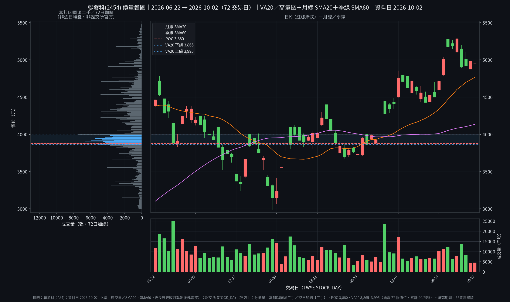

# 2454 聯發科 — 投資評估報告

> 依 `methodology/workflow.md` 五階段流程執行，格式依 `methodology/09-report-format.md`。僅供學習用途，非投資建議。本版為更新報告（Update 分支：重跑階段 0、3、4、5），所有「部位建議」皆為分析師草稿，只依公開資料與 repo 方法論推導，不含任何個人持倉或資產資訊。

```
Data & Sources
  Produced:   2026-10-04
  As of:      2026-10-02 收盤（股價 NT$4,950；週日休市，這是最新完整交易日）；
              2026-06-30（最新季報 2Q26，法說 2026-07-31；3Q26 財報尚未公布）；
              2026-08（最新月營收，2026-09-10 公布；9 月營收排 2026-10-08）
  Source:     【一手：公司 IR（mediatek.com/investor-relations）】2Q26 新聞稿、簡報、法說逐字稿、財務報表摘要（2026-07-31）；
                2Q26 / 1Q26 / 2025 年度合併財報（IR「Consolidated Report」，含附註與會計師報告）；
                3Q24–1Q26 各季簡報與新聞稿（逐季指引對實際）；2025 年報（英文）；2026 年 1–8 月月營收公告；Investor Calendar
              【官方：證交所 TWSE】個股日成交資訊 2025-10 至 2026-10（STOCK_DAY）、BWIBBU 本益比／股價淨值比（2026-10-01、2026-10-02）、
                MI_QFIIS 外資持股與 T86 三大法人（2026-10-01、2026-10-02；見下方缺件說明）
              【二手】富邦 DJ 分價量表 72 日（2026-06-22 至 2026-10-02）；HiStock 個股本益比月頻表（2026-10-04 重抓；5 年分位為自算）；
                stockanalysis.com / S&P Global（分析師目標價、EPS 與營收共識、beta、RSI；頁面價格 2026-10-02、2026-10-03 更新）；
                Investing.com 台灣 10 年公債殖利率 1.970%（2026-10-01）；
                MoneyDJ / 鉅亨網轉載的公開資訊觀測站重大訊息（海外可轉債訂價公告，2026-08-31）；
                經濟日報、聯合新聞網、今周刊、工商時報、時報資訊、三立 2026-08-31 至 2026-09-30 報導；ifa.ai、gooptions 籌碼頁（2026-10-02）
              【缺件】公開資訊觀測站（MOPS）與 doc.twse：2026-10-01 診斷為整站封鎖，本次未繞過（內部人持股異動、重大訊息原文為缺件）；
                TWSE MI_QFIIS、T86 2026-10-01、2026-10-02 本次各重試兩次被擋，改用同日、同來源、2026-10-04 11:57–11:58 已取得的全市場檔案（含 2454 列）；
                openapi.twse.com.tw 未再嘗試；MOPS 版 3Q26 法說日期缺件（IR 日曆尚未列出）
  來源標示定義:【一手】公司自己發布的文件：IR、法說會、財報原檔（含公司經公開資訊觀測站申報的版本）；
              【官方】交易所、主管機關的市場資料：個股日成交、三大法人、外資持股等；
              【二手】券商與資料商頁面、分析師共識、新聞、第三方彙整；
              【缺件】該取而取不到的來源。寫出被什麼擋、重試幾次；不用瀏覽器、換 IP 等方式繞過阻擋
  Retrieval:  web/tool retrieval（GitHub connector 讀 repo；curl 抓公司 IR 與 TWSE；WebSearch / WebFetch 抓二手頁面）
  Confidence: MEDIUM。損益、資產負債表、現金流、指引、月營收、客戶集中度來自公司 IR 原檔（一手）；股價、本益比、外資持股來自證交所。
              分析師目標價、共識 EPS 與營收、beta、公債殖利率、可轉債條款（MOPS 缺件，轉載頁）為二手。市值、EV、ROIC、WACC、DCF、
              TTM 現金流與 EBITDA 為自行估算（以 ~ 標示）。資料新鮮度警示：2Q26 財報資料日 2026-06-30，距 As of 已 94 天、距 Produced 96 天，
              超過 90 天（3Q26 財報尚未公布）；2025 年報持股資料為 2026-01-08（超過 90 天）。
              WACC：Rf 1.97% + β 1.96 × ERP 6% + 地緣溢價 1% = Re 14.73%，負債權重~0.3%，算得~14.7%（β 為單一二手來源，見 3.2 與 4.2）。
```

截至 2026-10-04（週日），最新一場法說仍是 2026-07-31 的 2Q26 法說。9 月營收排在 2026-10-08 17:00（公司 IR 日曆），3Q26 財報／法說的日期在 IR 日曆尚未列出（上一版寫的 2026-10-23 來自 TradingView，本次未能由公司原文確認，不採用）。上一版寫入（2026-10-02）之後，公司沒有新的財測；2026-09-29 的 Google TPU「掉單」傳聞，公司對媒體回應為「不實傳言」（二手報導）。

---

## 結論先講

| 項目 | 結果 |
|------|------|
| 是不是好公司？ | **中等偏弱**：護城河 5.4/10（Narrow，手機變窄、資料中心尚未驗證）；ROIC − WACC −1.6 pp；淨現金 NT$1,714 億（銀行借款與租賃口徑） |
| 是不是好價格？ | **非常貴**：綜合內在價值 ~NT$2,430，現價 NT$4,950，安全邊際 −104% |
| 綜合分數 | **3.8 / 10**（Underweight：多數訊號負面） |
| 建議動作 | **放棄**；GARP 進場價 ≤ NT$2,190，價值進場價 ≤ NT$1,820 |
| 最大風險 | 價格已反映 2027 年資料中心 ASIC 目標（共識 2027E EPS +114%）；1H26 營運現金流只有淨利的 0.13x、存貨年增 77%；首款 AI ASIC 要到 4Q26 才量產，2026-09-29 已有供應鏈傳聞 |

**一句話**：手機變弱、1H26 現金轉換差，股價先反映還沒出貨的資料中心目標；三種方法加權的內在價值 ~NT$2,430，現價高一倍有餘。

快篩觸發 F-Score 2/9（≤ 3）。依 workflow 應淘汰。下面仍把分數算完。

---

## 關鍵數據

| 項目 | 數值 |
|------|------|
| 股價 | NT$4,950（2026-10-02 收盤，−30；證交所） |
| 市值 / EV | ~79,007 / ~77,378（EV = 市值 − 淨現金 1,714 + 非控制權益 85，自行估算） |
| 近 4 季 EPS | NT$60.68（3Q25 15.84 + 4Q25 14.39 + 1Q26 15.17 + 2Q26 15.28） |
| P/E（TTM） | 81.75x（證交所 BWIBBU 2026-10-02；自算 4,950 / 60.68 = 81.58x，差異來自證交所採用的財報 EPS 口徑）。5 年中位數 19.7x（HiStock 月頻本益比表 2021-11 至 2026-10，59 個月值〔該頁缺 2023-08〕，2026-10-04 重抓；中位數為自算，二手；p25 12.0x / p75 22.2x，現值落在~第 98 百分位）；同表 5 年平均 22.9x（自算） |
| P/B | 18.63x（證交所 2026-10-02；每股淨值 NT$265.8，母公司權益 4,241.9 / 15.961 億股） |
| EV/EBITDA | ~67.7x（EV 77,378 / TTM EBITDA ~1,142，自行估算） |
| P/FCF | ~99.8x（市值 79,007 / TTM FCF ~791.6，扣廠房設備與無形資產購置；1H26 單獨為負，見 3.3） |
| 現金殖利率 | 1.08%（證交所 2026-10-02；2025 年度每股現金股利 NT$53.5 / 現價） |
| 1 年 / 今年以來報酬 | 1 年 +286.7%（2025-10-02 收盤 1,280 → 4,950）/ 今年以來 +246.2%（2025-12-31 收盤 1,430 → 4,950）。皆為證交所日收盤自算。52 週盤中區間 1,130（2025-11-21）至 5,480（2026-09-22），現價低於 52 週高點 9.7% |
| 外資持股 | 56.12%（證交所 2026-10-02；2026-10-01 為 56.21%）。外陸資 2026-10-01 賣超 571,884 股、2026-10-02 賣超 1,471,675 股，~−28.5 億、~−72.8 億（股數 × 收盤價，自行換算） |
| 流通股數 | 15.961 億股（2Q26 合併財報：普通股 16.0390 億股，減子公司翔發投資持有 0.0779 億股；證交所 2026-10-02 已發行 16.0495 億股） |

金額單位：NT$億。市值 = 15.9610 × 4,950 = 79,007，自行估算。上一版流通股數 15.983 億股是把子公司持股的成本金額 55,970 千元誤當股數扣除，本版已更正。淨現金口徑 = 現金及流動金融資產 1,984 − 短期借款 171 − 長期借款 1.2 − 租賃負債 98；另有長期應付款（含一年內到期，智慧財產等分期款）231 屬類債項目，未計入此口徑，計入後為 1,483。

**營收結構（2Q26，公司簡報）**：智慧裝置平台 53%（季增 19%、年增 26%）、手機 41%（季減 14%、年減 20%）、電源管理 IC 6%（季增 11%、年增 6%）。

**客戶集中度（2025 年度，IR 2025 合併財報附註，一手）**：客戶 A 923.1 億（15.5%）、客戶 B 719.3 億（12.1%）、客戶 C 678.0 億（11.4%），合計 2,320.5 億（38.9%）。2024 年為客戶 B 644.7、C 647.4、D 791.8 三家，合計 2,083.9 億。公司未揭露客戶名稱。

### 關鍵數據補充：價量疊圖



資料日：2026-10-02 收盤。K 線與成交量：證交所 STOCK_DAY 日資料【官方】；分價量：富邦 DJ 72 日加總表（2026-06-22 至 2026-10-02，富邦DJ同源二手／72日加總，非逐日堆疊、非證交所官方）【二手】。

| 圖上項目 | 數值 | 來源 / 算法 |
|----------|------|-------------|
| 控制點 POC（成交量最大價位） | NT$3,880（12,439 張） | 【二手】富邦 DJ 72 日分價量 |
| 價值區 VA20（定義：自 POC 向兩側擴張，累計成交量 ≥ 20% 的價格區間） | NT$3,865–3,995，涵蓋 27 個價位（每檔 5 元），累計 136,645 張 = 20.29%（72 日總量 673,345 張；分價表共 499 個價位，2,990–5,480） | 【二手】同上，自行彙整，已用第二種寫法重算核對 |
| 現價相對價值區 | 2026-10-02 收盤 NT$4,950（【官方】證交所）：+23.9%（在區間上方；對 VA20 上緣 3,995）；高於 POC +27.6% | 自算 |
| SMA20 / SMA60 | 4,765 / 4,134 | 【官方】證交所日收盤自算（以 243 個交易日歷史計算，再裁進 72 日窗顯示） |

圖例：紅漲綠跌（#ff6b6b / #51cf66）；SMA20 橘色細實線、SMA60 紫色細實線；POC 紅色虛線；VA20 上下緣藍色點線。研究用圖，非買賣建議。

---

## 階段 2：快篩淘汰 ❌ 淘汰（觸發：F-Score 2/9）

| 淘汰條件 | 聯發科 | 結果 |
|----------|--------|------|
| ROIC < WACC（連續 2 年以上） | ROIC 13.1% vs WACC 14.7%（2Q26 TTM，自算），利差 −1.6 pp。同公式 2Q25 TTM ROIC 18.9%，利差 +4.2 pp，所以只有最近一個年度為負 | ⚠️ 一年為負，不滿兩年 |
| F-Score ≤ 3 | 2 / 9（見 3.3） | ❌ |
| CFO / 淨利 < 0.7x（連續多年） | 1H26 0.13x；TTM 1.13x；2025 年 1.53x（營運現金流 1,627.9 / 淨利 1,061.2） | ⚠️ 這半年很差，TTM 與全年不低 |
| Net Debt / EBITDA > 4x | 淨現金。有息負債 270 / TTM EBITDA ~1,142 = 0.24x | ✅ |
| 會計師更換、重編、持續經營疑慮 | 安永聯合會計師事務所；2025 年度查核報告為無保留意見；1Q26、2Q26 核閱報告簽證會計師同為胡慎緁、許新民，結論為未發現重大不符。沒有重編、沒有持續經營疑慮的記載 | ✅ |

需要深入查的標記項目：
- ⚠️ 存貨天數 102 天（前季 87、一年前 66）。存貨餘額 984.2，年增 77%
- ⚠️ 1H26 營運現金流 65.9；1Q26 單季為 −176.6。1H26 支付所得稅 104.3（1H25 42.4）、存貨增加 313.0
- ⚠️ 應收帳款 770.8，年增 10.4%，2Q 營收年增 1.2%，形式上觸發 03 §3「應收成長 > 營收成長 2 倍」紅旗（見 3.3）
- ⚠️ 前三大客戶合計占 2025 年營收 38.9%，單一客戶最高 15.5%
- ⚠️ 2026-08-31 訂價的 US$39 億海外可轉債（2026-09-08 預定發行，資金用於外幣購料）：最大稀釋比例 1.67%（公司公告）；上一版寫的「US$50 億彈性融資額度不是已動撥」已過時

依 workflow 應淘汰。以下仍完成分析，說明價格與體質。

---

## 階段 3：深入研究

### 3.1 生意與護城河 → 護城河分數 **5.4 / 10（Narrow，手機變窄、資料中心尚未驗證）**

**供應鏈位置**：無晶圓廠 IC 設計，中游。先進製程與先進封裝的瓶頸在台積電(2330) 與封裝廠，聯發科(2454) 是二階受益者。資料中心 ASIC 要到 4Q26 才開始量產；法說提到 CoWoS 與 EMIB-T 兩種封裝路線。

**護城河來源**

| 來源 | 證據 | 強度 |
|------|------|------|
| 智慧財產與平台 | 法說（2026-07-31）：記憶體、I/O、連線的預驗證子系統；448G SerDes、Co-Package Copper、台積電 COUPE 上的 CPO；3.5D 平台；2 奈米旗艦 SoC 於 3Q26 推出；與 NVIDIA 的 RTX Spark 筆電 2026 年底上市 | 中 |
| 客戶轉換 | 手機客戶把旗艦與入門分開做。公司預期全球手機出貨今年下滑 15%（單位，公司用語 about 15%）。手機營收年減 20%，毛利率年減 2.9 pp（公司說一年前有一次性利益） | 中，正在變窄 |
| 規模與研發 | 2025 年營收 5,959.7，研發 1,483.1（24.9%）；2Q26 研發 393.6（25.9%）。前三大客戶合計 38.9% | 中 |
| 資料中心 | 與一家美國大型雲端服務商合作的第一顆 AI 加速器 ASIC，4Q26 量產；2026 年資料中心營收預期超過 US$20 億；2027 年 SAM US$800 億（僅加速器、不含 HBM），市占目標由 10–15% 上修到 15–20%；第二顆 ASIC 目標 2028 年初量產。第三方佐證（二手）：NVIDIA 認購 US$35 億可轉債，Alphabet 亦參與 | 尚未變現 |

**Porter 五力（5 分代表對聯發科最有利）**

| 力量 | 分數 | 說明 |
|------|------|------|
| 同業競爭 | 2 | 手機有高通。資料中心 ASIC 有博通、Marvell；2026-09-29 傳聞稱客戶傾向後兩家的量產實績（公司回應不實，二手） |
| 新進者威脅 | 3 | 先進節點設計與封裝協作門檻高，但第一顆 ASIC 還沒量產 |
| 供應商議價力 | 2 | 產能在台積電；先進封裝（CoWoS、EMIB-T）供給是執行風險。公司核准 US$50 億彈性融資預算並發行 US$39 億可轉債，用途是確保外幣購料 |
| 買方議價力 | 2 | 手機 BOM 上升、需求弱，公司說正調整價格轉嫁成本；資料中心目前講的是一家大型雲端客戶；前三大客戶 38.9% |
| 替代品威脅 | 3 | 客製 ASIC 對上博通這類已量產方案，替代來自同業而不是新技術 |
| **產業吸引力** | **2 / 5** | (2+3+2+2+3) / 5 = 2.4，記 2 |

**瓶頸分數**：4 / 10。公司不是產能瓶頸，而是依賴瓶頸的二階受益者。股價交易的是 2027 年市占目標，出貨從 4Q26 才開始。

**護城河綜合分數**

| 項目 | 權重 | 分數 | 加權 |
|------|------|------|------|
| 護城河來源強度 | 25% | 6 | 1.50 |
| 持久性 | 20% | 5 | 1.00 |
| 競爭地位 | 20% | 6 | 1.20 |
| 產業吸引力 | 15% | 4 | 0.60 |
| 定價能力 | 10% | 4 | 0.40 |
| 創新定位 | 10% | 7 | 0.70 |
| **合計** | | | **5.4** |

1.50+1.00+1.20+0.60+0.40+0.70 = 5.40。產業吸引力 2/5 換成 4 分再乘權重。與上一版 5.3 的差別只有創新定位 6 → 7：新增 NVIDIA NVLink Fusion 合作（公司 2026-08-31 宣布，經濟日報轉載，二手）與 RTX Spark 產品時程，其餘五項沒有新證據，不動。

### 3.2 財務體質 → **獲利仍在，現金轉換在 1H26 轉差；ROIC 低於 WACC**（ROIC − WACC −1.6 pp）

**成長與獲利**

| 期間 | 營收（NT$億） | YoY | 毛利率 | 營業利益率 | EPS |
|------|---------------|-----|--------|------------|-----|
| 2024 | 5,305.9 | — | 49.6% | 19.3% | 66.92 |
| 2025 | 5,959.7 | +12.3% | 47.5% | 17.4% | 66.16 |
| 3Q25 | 1,421.0 | +7.8% | 46.5% | 15.6% | 15.84 |
| 4Q25 | 1,501.9 | +8.8% | 46.1% | 14.5% | 14.39 |
| 1Q26 | 1,491.5 | −2.7% | 46.3% | 15.3% | 15.17 |
| 2Q26 | 1,521.8 | +1.2% | 46.2% | 15.0% | 15.28 |
| 1H26 | 3,013.3 | −0.8% | 46.2% | 15.2% | 30.45 |
| 3Q26 指引 | 1,522–1,598 | +7% 至 +12% | 46% ± 1.5 pp | 費用率 31% ± 2 pp | — |
| 2026-07 單月 | 484.8 | +12.2% | — | — | — |
| 2026-08 單月 | 641.8 | +44.1% | — | — | — |
| 2026-01–08 | 4,139.9 | +5.8% | — | — | — |

2Q26 營收百萬元原值 152,183，上表換成億；營業利益 228.7，較去年同期 −22.2%。3Q26 指引的匯率假設為 32。2026 年每月營收（NT$億，年增）：1月 469.8（−8.2%）、2月 389.5（−15.6%）、3月 632.2（+12.9%）、4月 467.4（−4.1%）、5月 474.3（+5.0%）、6月 580.1（+2.8%）、7月 484.8（+12.2%）、8月 641.8（+44.1%）。公司新增全年財測：2026 年美元營收預期成長在「高個位數」區間的上緣；毛利率落在目前單季財測區間內。

**3Q26 追蹤（自行估算，匯率沿用公司指引 32，實際匯率未知）**：7 月 484.8 + 8 月 641.8 = 1,126.6，已達指引下緣 1,522 的 74.0%。要落在指引區間，9 月需要 ~395–471；2025-09 單月為 543.3（3Q25 營收 1,421.0 減 7、8 月 432.2 與 445.5，自行換算），若 9 月與去年同月持平，3Q ~1,670，高於指引上緣 1,598 ~4.5%；若與 8 月持平，3Q ~1,768。這只是換算，不是預測；9 月營收 2026-10-08 才公布。

**營運槓桿**：營業費用率 2Q26 31.2%（1Q26 31.0%、2Q25 29.6%），研發持續增加；營業利益率 15.0%，比一年前低 4.5 pp。非營業收益 2Q26 50.9（占營收 3.3%，主要為利息與股利收入），所以稅前淨利率高於營業利益率。

**資產負債表（2026-06-30）**

| 指標 | 數值 | 判定 |
|------|------|------|
| 現金及約當現金 | 1,890.0（現金及流動金融資產 1,984.0） | — |
| 有息借款 | 270.1（短期借款 171.0 + 長期借款 1.2 + 租賃負債 97.9）；另長期應付款（含一年內到期）231.4 屬類債 | — |
| 淨現金 / 淨負債 | 淨現金 1,714.0（計入長期應付款後 1,482.6） | ✅ |
| Net Debt / EBITDA | 淨現金。有息負債 / TTM EBITDA = 270.1 / ~1,142.3 = 0.24x | ✅ |
| 流動比率 | 1.24x（2025-06-30 為 1.35x） | ⚠️ 下降，低於 checklist 的 1.5x |
| 利息保障倍數 | 1H26 營業利益 457.6 / 財務成本 1.9 = 245x | ✅ |
| 商譽 / 總資產 | 681.2 / 7,874.5 = 8.7%；1H26 無減損認列 | ✅ |
| 現金轉換週期（CCC） | 應收 47 天 + 存貨 102 天 − 應付 56 天 = 93 天（應收與存貨天數為公司 2Q26 新聞稿值；應付天數自行估算） | ⚠️ 存貨與應收天數都上升（2Q25 ~65 天） |

總資產 7,874.5，總負債 3,548.1，權益 4,326.4（母公司 4,241.9、非控制權益 84.5）。應付天數 = 應付帳款 513.3 / 2Q26 銷貨成本 818.7 × 90 = 56，自行估算。**期後事項（二手）**：US$39 億零票息海外可轉債，2026-08-31 訂價、預定 2026-09-08 發行，5 年期，轉換價 NT$4,513.75（訂價日收盤 3,925 的 115%），NVIDIA 認購 US$35 億（17,500 張）；發行後現金與負債同步增加 ~NT$1,200 億以上（公司公告金額換算，自行估算），淨現金大致不變，會出現在 3Q26 資產負債表。本表不含此筆。

**DuPont**：2Q26 ROE（年化，自算）~22.8% = 淨利率 16.2% × 資產週轉 ~0.77（單季 0.193 年化）× 權益乘數 1.82。報酬主要來自利潤率，槓桿低；與一年前比，利潤率與週轉都下降。

**ROIC / WACC（自行估算）**

```
TTM EBIT   3Q25 221.9 + 4Q25 218.5 + 1Q26 228.9 + 2Q26 228.7 = 898.0
有效稅率   13.0%（TTM 稅 145.8 / 稅前 1,120.9，IR 新聞稿損益表）
NOPAT      898.0 × (1 − 13.0%) = ~781.1

投入資本   權益 4,326.4 + 總負債 3,548.1 − 現金及約當現金 1,890.0 = 5,984.5（02 的公式）
ROIC       781.1 / 5,984.5 = 13.1%
WACC       14.7%（Rf 1.97% 為 2026-10-01 的 10 年公債；β 1.96，stockanalysis 5 年；ERP 6%；地緣溢價 1%；負債權重~0.3%）
利差       13.1% − 14.7% = −1.6 pp
```

**ROIC 趨勢（同一公式，自行估算）**：2Q25 TTM ROIC 18.9%（EBIT 1,047.1、稅率 12.5%、NOPAT ~916.2；投入資本 權益 3,845.3 + 負債 2,846.9 − 現金 1,853.5 = 4,838.7），到 2Q26 的 13.1%，下降 5.9 pp，利差由 +4.2 pp 轉為 −1.6 pp（WACC 以 14.7% 不變計）。**β 敏感度**：β 2.36（上一版 TradingView，無回看期間）Re 17.1%，利差 −4.1 pp；β 1.2 則 Re ~10.2%，利差 ~+2.9 pp。β 這一個來源決定利差的正負，報告採 β 1.96（stockanalysis，5 年，有明示期間）。

### 3.3 盈餘品質 → **普通**（會計品質 **15 / 21**）

**Piotroski F-Score：2 / 9**（依 repo 定義，2Q26 對 2Q25 的單季口徑；stockanalysis 頁面顯示 4，定義不同，不採用）

比較日是 2026-06-30 對 2025-06-30，數字來自 IR 新聞稿與 2Q26 合併財報。

| # | 條件 | 結果 |
|---|------|------|
| 1 | ROA > 0 | ✅ 2Q26 淨利 246.1 / 總資產 7,874.5 = 3.12% |
| 2 | CFO > 0 | ✅ 2Q26 營運現金流 242.5；1H26 65.9（1Q26 單季 −176.6） |
| 3 | ROA 改善 | ❌ 2Q25 同口徑 4.19% |
| 4 | CFO / 總資產 > ROA | ❌ 2Q26 CFO / 總資產 3.08% < ROA 3.12%；1H26 CFO / 淨利 0.13x |
| 5 | 槓桿下降 | ❌ 長期負債（含一年內到期）/ 總資產 1.85%，一年前 0.50% |
| 6 | 流動比率改善 | ❌ 1.24x，一年前 1.35x |
| 7 | 沒有增發新股 | ❌ 普通股 16.0390 億股 vs 一年前 16.0166 億股，來自限制員工權利新股 |
| 8 | 毛利率擴張 | ❌ 2Q26 46.2% vs 2Q25 49.1% |
| 9 | 資產週轉改善 | ❌ 2Q26 營收/資產 0.1933，2Q25 為 0.2247 |

| 指標 | 數值 | 判定 |
|------|------|------|
| Piotroski F-Score | 2 / 9 | ❌ |
| CFO / 淨利 | 1H26 0.13x；TTM 1.13x（1,103.0 / 975.1）；2025 年 1.53x | ⚠️ 半年差、TTM 與全年不低 |
| FCF / 淨利 | TTM 81%（FCF 791.6 / 淨利 975.1）；1H26 −29%（FCF −141.5 / 淨利 489.8）；2025 年 129%（FCF 1,373.7 / 1,061.2） | ⚠️ TTM 剛過 80%，但 1H26 為負 |
| 應收帳款成長 vs. 營收成長 | 應收 770.8 vs 一年前 697.3，+10.4%；2Q 營收 +1.2%，形式上觸發 03 §3 的「應收成長 > 營收成長 2 倍」紅旗。深入查核：應收天數 47（一年前 45，公司值）；應收 / 6 月單月營收 = 1.33，一年前 1.24（6 月營收 580.1 vs 564.3，+2.8%）。季末月份營收只解釋小部分差距 | ❌ 形式觸發紅旗，已查核，列入 Bear 與待追蹤 |
| 存貨成長 vs. 營收成長 | 存貨 984.2 vs 一年前 554.8，+77.4%，營收 +1.2%；天數 102（一年前 66）。公司歸因：智慧裝置平台含電視晶片的 DRAM 內容，以及確保供應鏈（法說） | ❌ |
| SBC / 營收 | 1H26 股份基礎給付 14.2 / 營收 3,013.3 = 0.47%；TTM 0.43% | ✅ |
| 非經常性項目 | 2Q26 毛利率年減 2.9 pp，公司說一年前有一次性利益。Non-TIFRS EPS 15.71，TIFRS 15.28 | ⚠️ |
| 會計師、重編 | 安永；2025 年度查核無保留意見；1H26 核閱。無重編 | ✅ |

1H26 自由現金流 = 營運現金流 65.9 − 購置不動產廠房及設備 108.2 − 購置無形資產 99.3 = −141.5。TTM 自由現金流 791.6 = TTM 營運現金流 1,103.0（3Q25 391.8 + 4Q25 645.2 + 1Q26 −176.6 + 2Q26 242.5，IR 新聞稿）− 設備 182.3 − 無形資產 129.0（2H25 數字 = 2025 年度減 1H25，IR 2025 合併財報與 2Q26 合併財報現金流量表）。上一版只有 1H26 數字，所以得出「FCF 為負、P/FCF 不適用」；補上 2H25 後 TTM 為正，1H26 的負值主要是存貨增加 313.0、應收增加 144.7、所得稅支付 104.3（對照 2H25 稅款支付偏低）。無形資產購置 1H26 229.6 新增（技術與專利），對應長期應付款（含一年內到期）231.4（2025 年底 105.0）。

**營運資金 / 營收增量（checklist B）**：(應收 + 存貨 − 應付) 1,240.8 對一年前 861.5，增加 379.3；對照 2Q 營收年增量乘 4（(1,521.8 − 1,503.7) × 4 = 72.6），比率~522%，遠高於 15%（自行估算；分母極小，數字僅作方向，結論是營運資金增加與營收增加脫鉤）。

**會計品質 15 / 21**（每項 0–3）

| 項目 | 分 | 依據 |
|------|----|------|
| 營收認列清晰度 | 3 | 三個平台都有占比與季增；年度報告有客戶集中度 |
| Non-GAAP 調節品質 | 2 | 有 TIFRS 與 Non-TIFRS 對照（排除股份基礎給付、取得資產攤銷），差距不大，但攤銷隨無形資產增加而上升 |
| FCF 轉換率 | 2 | TTM 81%，但 1H26 為負 |
| 營運資金趨勢 | 0 | 存貨年增 77%、天數 102；營運資金增量與營收增量脫鉤 |
| 附註透明度 | 3 | 商譽、股利、股份基礎給付、無形資產、長期應付款、客戶集中度都在附註 |
| 會計師意見 | 2 | 期中是核閱，年度為查核無保留意見 |
| 關係人交易 | 3 | 關係人應收 0.8，相對營收可忽略 |

3+2+2+0+3+2+3 = 15。落在 12–17，普通。上一版 13 的差別在 FCF 轉換率 0 → 2：這版取得 2025 年度與 2H25 現金流，TTM 轉換率 81%；這是資料補齊，不是 1H26 現金流變好。

### 3.4 管理層 → **股利靠現金部位，不是靠自由現金流；資本支出偏向外購技術與供應鏈**（資本配置 **4.9 / 10**）

**指引可信度：8 / 8**。命中定義：該季營收與毛利率都落在區間內，或高於高標（匯率假設與實際不同，一律以新台幣區間判定，不做匯率還原）。來源是公司 IR 各季簡報的 Business Outlook（前一季簡報給下一季指引）與各季新聞稿實際值，本次逐季重新核對。

| 季 | 營收實際 vs 指引（NT$億） | 毛利率實際 vs 指引 | 命中 |
|----|---------------------------|--------------------|------|
| 3Q24 | 1,318.1 vs 1,235–1,324 | 48.8% vs 47% ± 1.5 pp | ✅ 營收在區間內，毛利率高於高標 0.3 pp |
| 4Q24 | 1,380.4 vs 1,265–1,345 | 48.5% vs 47% ± 1.5 pp | ✅ 營收高於高標，毛利率在上緣 |
| 1Q25 | 1,533.1 vs 1,408–1,518 | 48.1% vs 47% ± 1.5 pp | ✅ 營收高於高標，毛利率在區間內 |
| 2Q25 | 1,503.7 vs 1,472–1,594 | 49.1% vs 47% ± 1.5 pp | ✅ 營收在區間內，毛利率高於高標 0.6 pp |
| 3Q25 | 1,421.0 vs 1,301–1,400 | 46.5% vs 47% ± 1.5 pp | ✅ 營收高於高標，毛利率在區間內 |
| 4Q25 | 1,501.9 vs 1,421–1,506 | 46.1% vs 46% ± 1.5 pp | ✅ 都在區間內 |
| 1Q26 | 1,491.5 vs 1,412–1,502 | 46.3% vs 46% ± 1.5 pp | ✅ 都在區間內 |
| 2Q26 | 1,521.8 vs 1,402–1,492 | 46.2% vs 46% ± 1.5 pp | ✅ 營收高於高標，毛利率在區間內 |

8/8，高於 6/8 的「強」。型態偏保守：八季裡四季營收高於高標，另四季在區間內，沒有一季低於低標。上一版只核到 4 季（4/4），這版補齊 8 季。

**資本配置**
- 2026-07-31 董事會核准 US$50 億彈性融資預算，用來確保產能與資料中心從晶片走到系統（法說）。2026-08-31 訂價 US$39 億零票息海外可轉債（5 年期，轉換價 NT$4,513.75，NVIDIA 認購 US$35 億，用途為外幣購料；全數轉換最大稀釋 1.67%；二手轉載公告，MOPS 缺件）。上一版稱「不是已動撥」，此點更正。
- 股利：2024 年每股 NT$54.0（上半年 29.0 + 下半年 25.0），2025 年 NT$53.5（29.0 + 24.5）；2026 年共識 NT$55.53（二手）。2025 年下半年股利除息日 2026-07-07、發放日 2026-07-31（公司 IR 日曆）。2026 上半年股利的董事會決議尚未公布。現金股利支付 TTM 861.3（2H25 398.5 + 1H26 462.9）。
- 併購：商譽 681.2，1H26 沒有減損，沒有新取得子公司（1H25 有小額 2.3）。1H26 無形資產新增 229.6（購入技術與專利）。
- 庫藏股：母公司沒有；子公司翔發投資持有 7,794,085 股（2001 年前為財務運作持有），沒有買回計畫。

**股利安全分數：42 / 100（D）**

| 項目 | 數值 | 得分 |
|------|------|------|
| 盈餘配發率（04 口徑：現金股利 / FCF） | TTM 現金股利 861.3 / TTM FCF 791.6 = 109%（用 2025 年 FCF 1,373.7 為 63%） | 0 / 25 |
| FCF 覆蓋倍數 | 791.6 / 861.3 = 0.92x（2025 年 1.60x） | 0 / 20 |
| 有息負債 / EBITDA | 270.1 / ~1,142.3 = 0.24x | 20 / 20 |
| 盈餘穩定性 | 2024 年淨利 1,071.4、2025 年 1,061.2（IR 年度合併財報），EPS 66.92 → 66.16 → TTM 60.68，近一年下滑。2021–2023 損益這次未取一手 | 12 / 20 |
| 股利紀錄 | 2021–2025 每股股利 73 / 76 / 55 / 54 / 53.5（stockanalysis，二手），5 年都有發放但 2023 年起下調；更長年表未取 | 10 / 15 |

0+0+20+12+10 = 42。上一版 37 是因為只核到 2024–2025 兩個股利年；這版補到 5 年二手紀錄，且用 TTM 實際 FCF。

資本配置 4.9 / 10：股利安全 4.2×20% = 0.84；股利成長（每股略降）4×10% = 0.40；沒有庫藏股買回 4×20% = 0.80；併購 7×20% = 1.40（商譽無減損）；債務管理 7×15% = 1.05（淨現金，新發零票息可轉債）；自由現金流運用 3×15% = 0.45（1H26 FCF 為負仍配息，存貨與外購技術增加）。合計 4.94，記 4.9。

**內部人與法說會語氣**：2026-07-31 語氣強。蔡力行把第一顆 ASIC 講成已做成、4Q 量產，並上修 2027 市占目標；同時把手機需求（BOM 成本上升、出貨預期 −15%）與價格調整講清楚。被問到市場報導時，他沒有逐項回應，只說專注於執行（逐字稿）。2026-09-29 TPU「掉單」傳聞，公司對媒體回應為不實傳言（聯合新聞網、Yahoo 奇摩轉載報導 2026-09-29 至 2026-09-30，二手）；公司原文公告（MOPS）為缺件。執行長蔡力行持股 872,950 股（0.05%），董事長蔡明介持股 41,798,248 股（2.61%）、配偶 39,336,145 股（2.45%）（2025 年報，持股日 2026-01-08，超過 90 天）。內部人買賣申報屬 MOPS，為缺件，市場訊號不用內部人買賣。

---

## 階段 4：估值與反方

### 4.1 盈餘預估

| 期間 | 假設 | EPS |
|------|------|-----|
| 最新實際（2Q26） | 新聞稿 | 15.28 |
| 1H26 實際 | 15.17 + 15.28 | 30.45 |
| TTM | 15.84 + 14.39 + 15.17 + 15.28 | 60.68 |
| 下一季 E（3Q26E） | （營收中值 1,560 × 營業利益率 15%〔毛利率 46%、費用率 31%〕+ 非營業 46〔近兩季均值〕）× (1 − 13.0%) − 非控制權益 2.5，÷ 15.961 億股。自行估算；7–8 月營收已到下緣的 74%，上檔風險在營收端 | ~15.1（3Q 共識 EPS 未取得） |
| 2026E 共識 | S&P Global，24 位，2026-10-02。區間 58.48–73.35（二手）。隱含 2H26 EPS 37.8，扣掉 3Q26E ~15.1 後隱含 4Q26 EPS ~22.7（自行換算），比 2Q26 的 15.28 高 ~49% | 68.24 |
| 2027E 共識 | 同一來源，由 68.24 增至 146.12（+114.1%）。營收 2026E 6,630.5（+11.3%）→ 2027E 11,700（+76.5%）（二手） | 146.12 |

| 本益比 | 數值 |
|--------|------|
| TTM | 81.75x（證交所；自算 81.58x） |
| 2026E 共識 | 72.5x（4,950 / 68.24） |
| 2027E 共識 | 33.9x（4,950 / 146.12） |
| PEG | 72.5 / 114.1 = 0.64（2026E 本益比 ÷ 2027E 共識成長率）。成長幾乎全押在尚未量產的 ASIC，PEG 不能單獨當買進理由 |

### 4.2 DCF（NT$億，基本情境）

**假設（自行估算）**：2026E 營收 6,630.5 取共識（對照公司指引：美元營收成長在高個位數區間上緣，約當新台幣 +11%，一致）；第 2 年營收取共識 2027E 11,700（+76.5%，驅動來自資料中心 ASIC，風險集中）；第 3–10 年成長 20% / 14% / 10% / 7% / 5% / 3.5% / 2.5% / 2.0%（自行遞減至接近永續成長）。FCF 利潤率 8% / 11% / 13% / 14% / 15%（第 5 年起維持 15%）：2025 年實際 FCF 利潤率 23.0%（1,373.7 / 5,959.7，含營運資金釋放）、TTM 13.3%（791.6 / 5,936.2）、1H26 −4.7%；第 1 年取 8%、之後升至 15% 為保守假設（對照共識 2026E FCF 922 億，二手，扣除項目口徑未明）。FCF 已扣股份基礎給付（real FCF = FCF − SBC，SBC 取 TTM 0.43% 營收）。WACC 14.7%（CAPM，β 1.96），永續成長 2.0%（05 的 Base）。淨現金取計入長期應付款後 1,482.6，扣非控制權益 84.5。股數 15.961 億。

| 年 | 營收 | FCF 利潤率 | FCF | 現值 |
|----|------|------------|-----|------|
| 1（2026E） | 6,630 | 8% | 502 | 438 |
| 2（2027E） | 11,700 | 11% | 1,237 | 940 |
| 3 | 14,040 | 13% | 1,765 | 1,169 |
| 4 | 16,006 | 14% | 2,172 | 1,255 |
| 5 | 17,606 | 15% | 2,565 | 1,292 |
| 6 | 18,839 | 15% | 2,745 | 1,205 |
| 7 | 19,781 | 15% | 2,882 | 1,103 |
| 8 | 20,473 | 15% | 2,983 | 996 |
| 9 | 20,985 | 15% | 3,057 | 890 |
| 10 | 21,404 | 15% | 3,118 | 791 |

```
FCF 現值合計          10,079
終值 = 3,118 × 1.02 / (14.7% − 2.0%) = 25,046 → 現值 6,355（占 EV 38.7%，低於 75% 上限）
EV                    16,434
+ 淨現金（計入長期應付款）   1,483
− 非控制權益              85
股權價值              17,832 ÷ 15.961 億股 = ~NT$1,117 / 股
```

**敏感度表（Base，每股 NT$）**

| WACC \ 永續成長 g | 1.5% | 2.0% | 2.5% |
|------|------|------|------|
| 12.0%（上一版 DCF 用 12%） | 1,418 | 1,452 | 1,489 |
| 14.0% | 1,169 | 1,189 | 1,211 |
| **14.7%** | 1,100 | **1,117** | 1,136 |
| 16.0% | 991 | 1,004 | 1,017 |
| 17.0%（接近 β 2.36） | 920 | 930 | 941 |

十五格都低於現價 NT$4,950（最高 1,489）。單看 Base 情境，沒有任何一格有安全邊際。

**反向 DCF**：維持 WACC 14.7%、g 2.0%、FCF 利潤率路徑不變，要讓 DCF 等於現價 NT$4,950，第 2–10 年營收需要每年成長~43.4%（常數，自行試算）；第 10 年營收 ~170,200 億，對照 Base 的 21,404 億（8.0 倍）。即使 WACC 降到 12%、g 升到 3%，仍需每年成長~35.6%（WACC 10% 為~29.9%）。現價隱含的不是共識的 2027 年一次性跳升，而是之後多年仍高速成長且利潤率維持，或更低的折現率。

### 4.3 三情境

| 情境 | 機率 | 關鍵假設 | 每股價值 |
|------|------|----------|----------|
| Bull | 20% | 2026 營收 6,800；2027 年 +85%（12,580）；其後 +30 / 22 / 15 / 10 / 7 / 5 / 3.5 / 2.5%；FCF 利潤率 9% 起升至 20%；WACC 13.7%；g 2.5% | ~2,130 |
| Base | 60% | 4.2，WACC 14.7%，g 2.0% | ~1,117 |
| Bear | 20% | 2026 同 Base；2027 年 ASIC 延後，營收僅 +15%（7,625），其後 +8 / 6 / 5 / 4 / 3.5 / 3 / 2.5 / 2%；FCF 利潤率停在 8%；WACC 15.7%；g 1.5% | ~371 |
| **機率加權** | | 0.2×2,130 + 0.6×1,117 + 0.2×371 | **~1,170** |

三情境的 g（2.5 / 2.0 / 1.5%）依 05 的 Bull / Base / Bear 設定；WACC 以 Base 為中心 ±1 pp（與 2330 報告同法）。終值占 EV：Bull 45.8%、Base 38.7%、Bear 29.6%。

### 4.4 足球場圖與安全邊際

| 方法 | 低 | 中 | 高 | 權重 |
|------|----|----|----|------|
| DCF（4.3 機率加權當中值） | 371 | 1,170 | 2,130 | 50% |
| P/E（共識 EPS × 五年中位數 19.72x） | 1,153 | 2,114 | 2,881 | 30% |
| 分析師目標價（S&P，27 位，2026-10-02，二手） | 4,000 | 6,062 | 10,369 | 20% |
| **綜合內在價值** | | **~2,430** | | |

P/E 低 = 2026E 低標 58.48 × 19.72。中 = (68.24 + 146.12) / 2 × 19.72。高 = 2027E 146.12 × 19.72。19.72x 是 HiStock 月頻本益比表 2021-11 至 2026-10 的中位數（自算，二手）。分析師目標價中位數 5,800、平均 6,062。**未納入權重的方法（權重 0）**：同業倍數——瑞昱(2379) 27.34x、聯詠(3034) 18.74x、祥碩(5269) 15.57x、義隆(2458) 12.83x、矽力*-KY(6415) 43.15x（證交所 2026-10-02 TTM P/E，中位數 18.74x）× 聯發科(2454) TTM EPS 60.68 = 低 779 / 中 1,137 / 高 2,618；只有 TTM P/E，沒有 05 §3 要求的 EV/Rev、EV/EBITDA、forward P/E、EV/FCF，且台灣沒有規模與成長相近的同業，所以僅列示；52 週區間 1,130–5,480 只作參考。P/E 與分析師目標價都源自同一份共識，兩條腿不獨立。

```
0.50×1,170 + 0.30×2,114 + 0.20×6,062 = 585.2 + 634.1 + 1,212.4 = 2,431.7，記 ~2,430
安全邊際 = (2,430 − 4,950) / 2,430 = −104%
風險報酬比 = Bull 上檔 −57.0%（NT$2,130 仍低於現價） / Bear 下檔 −92.5%（NT$371） = 0 : 1 → ❌（門檻 3 : 1）
```

GARP 進場價 = 2,430 × 0.9 = NT$2,187，記 NT$2,190。價值進場價 = 2,430 × 0.75 = NT$1,822.5，記 NT$1,820。成長型進場價 = NT$2,430。

**方法選擇敏感度（自行估算，供決策參考，不改本報告數字）**：P/E 改用 5 年平均 22.9x → 內在價值~2,535，安全邊際 −95%；改用上一版的遠期本益比平均 18.4x → ~2,389，−107%；目標價改用中位數 5,800 → ~2,379，−108%；權重改回上一版 40 / 30 / 30 → ~2,921，−69%。所有組合安全邊際都在 −69% 以下，結論（放棄）不依賴方法選擇。

### 4.5 Bear Case → 強度 **7.2 / 10（強）**

| 支柱 | 分數 | 論點 |
|------|------|------|
| 估值過高 | 2.0 / 2 | TTM 81.75x，為五年中位數 19.7x 的 4.1 倍（第 98 百分位）。現價比三種方法加權值高 104%，DCF 多頭情境 ~2,130 仍低於現價，反向 DCF 需要每年 43% 成長 |
| 基本面惡化 | 1.2 / 2 | 手機年減 20%；毛利率由 2024 年 49.6% 降到 2Q26 的 46.2%；存貨天數 102。抵銷：智慧裝置平台年增 26%，7–8 月營收已達 3Q 指引下緣的 74%，公司把全年美元成長提到高個位數上緣（上一版 1.5） |
| 會計紅旗 | 1.5 / 2 | 1H26 CFO / 淨利 0.13x、自由現金流 −141.5；F-Score 2/9；應收年增 10.4% 觸發 03 紅旗；營運資金增量與營收增量脫鉤。TTM 現金流轉換 81% 為緩衝 |
| 競爭與長期威脅 | 1.2 / 2 | 第一顆 ASIC 來自單一美國雲端客戶；2026-09-29 TPU 傳聞（公司稱不實）；英特爾 EMIB-T 載板供應與 CoWoS 備援是執行風險（外資報告，二手）；前三大客戶 38.9% |
| 管理層 | 0.6 / 1 | 量產前就把 2027 市占目標上修，並先核准 US$50 億融資預算、發行 US$39 億可轉債（NVIDIA 認購 89.7%（17,500 / 19,500 張），供應商兼策略合作方，循環關係風險）；CEO 持股 0.05% |
| 催化劑 | 0.7 / 1 | 2026-10-08 九月營收、3Q26 法說（日期未確認）。若 ASIC 時程後移或 4Q 指引不如共識隱含的跳升，空頭會強化 |
| **合計** | **7.2 / 10** | 2.0+1.2+1.5+1.2+0.6+0.7 |

**空頭目標價與下檔**：空頭目標價 = 4.3 的 Bear 情境 ~NT$371（下檔 −92.5%）。基本面底部：淨現金每股~NT$107（1,714 / 15.961 億股）；每股淨值 NT$265.8。兩者都遠低於現價，所以 Bear 的下檔主要是倍數與成長預期壓縮。

**Thesis-Killers（推翻空頭論點的條件）**
- 7–9 月合計營收 ≥ 1,598（指引上緣），且 3Q26 毛利率 ≥ 46%：推翻「基本面惡化」
- 3Q26 法說維持「4Q26 首顆 ASIC 量產、2026 年資料中心營收超過 US$20 億」，並給出 4Q 指引，使共識隱含的 4Q26 EPS ~22.7 成立：推翻「ASIC 時程風險」
- 單季自由現金流（扣設備與無形資產）轉正、存貨天數降到 ≤ 90 天：推翻會計與營運資金紅旗
- 現價回到 ≤ NT$2,190（GARP 進場價）：推翻「估值過高」

**最強的多頭反駁，以及為什麼仍不同意**：最強的反駁是 8/8 指引命中、7–8 月營收 +44%（8 月）、NVIDIA 與 Alphabet 的策略性參與、與 2027 年共識 EPS +114%。承認這些是真實的成長證據；不同意的是價格——現價已反映每年 43% 的長期營收成長，單看 Base 情境十五格敏感度都低於現價，所以空頭論點的核心是安全邊際，不是生意品質。

注意：`workflow.md` 規定「Bear Case 強度 ≤ 4.0 才繼續」，這裡是 7.2，未通過該門檻；F-Score 2/9 也已觸發階段 2 淘汰。這版與上一版一樣仍完成後續階段，是因為這是既有標的的更新報告；此項列在 5.2 F 區為 ❌，並在 `自查結果.md` 揭露。

### 4.6 題材熱度（08 §9）

| 觀察項 | 狀態 |
|--------|------|
| 股價漲幅 vs. EPS 上修 | 🔴 今年以來股價 +246.2%、1 年 +286.7%；TTM EPS 60.68 低於 2025 年 66.16，2026E 共識 68.24 僅較 2025 年 +3.1%；P/E 81.75x 在 5 年第 98 百分位 |
| 媒體 | 🔴 2026-09-29 單日 −7.1% 收 4,910（TPU 傳聞，公司稱不實）；同期外資調高目標價（瑞銀 6,500 → 7,300、摩根士丹利 5,588 → 6,188，二手）。兩邊都不是公司新聞稿 |
| 股價波動 | 🟡 已實現波動率 20 日 ~53%、60 日 ~66%（年化，證交所日收盤自算；60 日內最大單日漲跌幅 10.4%）。08 §9 沒有明訂波動率門檻，僅列參考 |
| 機構持股 | 🟡 外資 56.12%（2026-10-02）。外陸資 2026-10-01 賣超 ~28.5 億、2026-10-02 賣超 ~72.8 億；近 5 日賣超 6,873 張，之前連續 7 日買超（gooptions / ifa.ai，二手） |
| 分析師 | 🟡 目標價平均 NT$6,062、中位數 5,800（27 位，2026-10-02，二手），最低 4,000 仍低於現價，最高 10,369，分歧大 |

**🔴 共 2 項（門檻 5 項）。題材生命週期判斷：擴散後段（價格領先盈餘，尚未到 5 項 🔴 的過熱門檻）。**

賣出理由在估值與現金轉換，不在題材熱度；🔴 只有兩項，不把題材打成過熱。

---

## 階段 5：決策

### 5.1 綜合評分

| 階段 | 權重 | 分數 | 依據 |
|------|------|------|------|
| 商業品質 | 25% | 5.3 | 護城河 5.4 與財務體質 5.1 的平均（5.25，記 5.3）。5.1 來自淨現金與 TTM 現金流轉換 81%，但 F-Score 2/9、ROIC − WACC −1.6 pp、存貨與營運資金拖累。財務體質分數沿用上一版 5.1（β 改 1.96 使利差由 −4 pp 變 −1.6 pp，但 ROIC 本身下降 5.9 pp 與現金流轉換差，互相抵銷） |
| 估值 | 25% | 0.0 | 安全邊際 −104%，風險報酬比 0 : 1。評分規則：合理價 5.0 分，溢價每 1% 扣 0.1，下限 0（5.0 + 0.10 × (−103.7) = −5.4，取 0）。07 只給端點（10 = 深度折價、5 = 合理、0 = 極度高估），此規則為本專案自訂並與 2330 報告一致；上一版 2.0 是判斷值 |
| 市場訊號 | 20% | 5.5 | 法說語氣強、全年財測上修到高個位數上緣、7–8 月營收領先指引、NVIDIA 與 Alphabet 的策略性參與、分析師目標上調；抵銷：2026-09-29 傳聞與外資連 2 日賣超、內部人買賣申報（MOPS）為缺件。上一版 4.5 → 5.5 為判斷值 |
| 技術面 | 15% | 6.5 | 2026-10-02 收盤 NT$4,950 在 SMA20 4,765、SMA60 4,134 之上，高於 72 日價值區 VA20 上緣 3,995 達 +23.9%（POC 3,880）；RSI 59.95（stockanalysis，二手）；距 52 週高點 −9.7%；60 日年化波動 ~66%。趨勢偏多但價格離量能密集區很遠，扣分。上一版 5.0（無均線） |
| 風險 | 15% | 2.8 | Bear 強度 7.2，反向 10 − 7.2 = 2.8（上一版 3.0 為判斷值；本版改機械式） |
| **綜合** | | **3.8** | 5.3×0.25 + 0.0×0.25 + 5.5×0.20 + 6.5×0.15 + 2.8×0.15 = 1.325 + 0 + 1.10 + 0.975 + 0.42 = 3.82，記 3.8（用 5.25 未進位則為 3.81） |

3.8 落在 07 的 3.5–4.9，對應 Underweight；安全邊際 −104%。**放棄**。上一版 3.9。

訊號衝突：商業品質 5.3、估值 0.0；分析師平均目標 NT$6,062 高於現價，DCF 與歷史本益比遠低於現價；技術面偏多。基本面與價格優先（07 §2），不採分析師目標當進場價。

### 5.2 檢核表彙整（checklist A–G）

未驗證的項目計入 ⚠️，不計 ✅。❌ 代表觸及 repo 明訂的紅旗或明確不達門檻；⚠️ 代表未達理想門檻但非紅旗，或證據不全。

| 區 | ✅ | ⚠️ | ❌ | 關鍵未過項目 |
|----|----|----|----|--------------|
| A 生意（6 項） | 1 | 3 | 2 | 五力平均 2.4 < 3.5 ❌；單一客戶 15.5%、12.1%、11.4% 皆 ≥ 10% ❌。護城河趨勢（手機變窄）、市占 3 年趨勢（無資料）、定價能力（毛利率年減）⚠️ |
| B 財務（7 項） | 3 | 2 | 2 | ROIC 13.1% < WACC 14.7% 且利差由 +4.2 pp 縮為負 ❌；營運資金增量 / 營收增量~522% ❌。流動比率 1.24x < 1.5x、CCC 93 天且上升 ⚠️。權益乘數 1.82x、淨現金、利息保障 245x ✅ |
| C 盈餘品質（8 項） | 3 | 3 | 2 | F-Score 2/9 ❌；應收年增 10.4% 觸發紅旗 ❌（已查核，見 3.3）。CFO / 淨利（1H26 0.13x、TTM 1.13x）、FCF / 淨利（TTM 81%、1H26 為負）、會計品質 15 / 21 ⚠️ |
| D 管理層（7 項） | 1 | 5 | 1 | CEO 持股 0.05% < 3% ❌。溢價收購風險、有機成長比例、內部人賣股（MOPS 缺件）、薪酬連結、資本配置 4.9 < 7 ⚠️。指引 8/8 ✅ |
| E 價格（5 項） | 3 | 0 | 2 | 安全邊際 −104% ❌；風險報酬比 0 : 1 ❌。三種方法交叉、終值占 EV 38.7%、PEG 0.64 ✅ |
| F 風險（4 項） | 2 | 1 | 1 | Bear 強度 7.2 > 4.0 ❌。單一年度到期債（短期借款 + 一年內到期長期負債 + 流動租賃 329.5 / 類債總額 501.4 = ~66%，主要為週轉性短借，淨現金 1,714 可覆蓋）⚠️。三個量化下檔風險、論點失效條件 ✅ |
| G 題材股（6 項） | 4 | 1 | 1 | EPS 上修追不上股價（TTM EPS 低於 2025 年，股價今年 +246%）❌。利潤是否往這一層集中 ⚠️。供應鏈位置（中游）、二階受益者、熱度 🔴 2 項、已寫 KPI ✅ |

A 6 + B 7 + C 8 + D 7 + E 5 + F 4 + G 6 = 43 項。✅ 17、⚠️ 15、❌ 11。

### 5.3 進場參考價與部位（以綜合內在價值 ~NT$2,430 為準）

| 風格 | 安全邊際要求 | 進場價 |
|------|----------------|--------|
| 價值 | 25% | ≤ NT$1,820 |
| GARP | 10% | ≤ NT$2,190 |
| 成長 | 0% | ≤ NT$2,430 |

**部位建議（分析師草稿，依 09 的格式與公開資料推導，不含任何個人持倉或資產資訊）**：高信心 5–7% / 中等 2–4% / 試單 1–2% / **不建倉**（擇一附理由）→ **不建倉**。理由：現價 NT$4,950 比成長型進場價~NT$2,430 高 104%；安全邊際 −104%；風險報酬比 0 : 1 低於 3 : 1；綜合 3.8 < 5.0；F-Score 2/9 已觸發淘汰；Bear 強度 7.2 未過 workflow 的 4.0 門檻。在進場價表任一檔被觸及前，維持不建倉。

**最關鍵的變數**：4Q26 第一顆 ASIC 是否如期量產，以及法說是否給出使 2027E 共識（營收 +76.5%、EPS +114%）成立的出貨數字。若 2027 年營收只有 Bear 情境的 +15%，DCF 價值由 ~1,117 降到 ~371。

### 5.4 論點與 KPI

**論點**：市場若把 2027 年 15–20% 資料中心市占當成現在的價格，這次的現金流、歷史本益比與 DCF 都不支持。買進要等價格回到進場價表任一檔，或等法說把量產與營收用已出貨的數字換掉目標。

| KPI | 門檻 | 來源 | 目前 | 狀態 |
|-----|------|------|------|------|
| 3Q26 營收 | 1,522–1,598 | 2026-07-31 指引 | 7–8 月合計 1,126.6；9 月需 ~395–471 才落在區間（自行換算）；9 月營收 2026-10-08 公布 | ⚠️ |
| 3Q26 毛利率 | 44.5–47.5% | 2026-07-31 指引 | 未公布 | ⚠️ |
| 資料中心 2026 營收 | 超過 US$20 億 | 2026-07-31 法說 | 尚未結算，量產排在 4Q26 | ⚠️ |
| 存貨天數 | 不再高於 102 天 | 2Q26 新聞稿 | 102 天 | ⚠️ |
| 單季自由現金流（扣設備與無形資產） | 轉正 | 2Q26 合併財報 | 2Q26 單季 CFO 242.5 − 設備與無形資產購置（1H26 207.4，單季未拆）；1H26 −141.5 | ❌ |

**論點失效條件**
- 上表有 2 個以上 KPI 跌破門檻，空頭論點加強，不是轉多
- 轉多要同時看到：3Q 營收與毛利率都在指引內或之上，而且法說把 4Q26 量產改成已開始出貨，加上價格回到進場價表任一檔

### 5.5 催化劑與重跑條件

| 日期 | 事件 | 要看什麼 |
|------|------|----------|
| 2026-10-08 17:00 | 9 月營收（公司 IR 日曆） | 7–9 月能否落在 1,522–1,598。9 月需 ~395–471；與去年同月（543.3）持平則 3Q 超出指引上緣（自行換算） |
| 2026-10 下旬至 2026-10-31（未確認） | 3Q26 財報與法說 | 公司 IR 日曆截至 2026-10-04 尚未列出。前例：2025-10-31、2026-02-04、2026-04-30、2026-07-31。毛利率、4Q 指引、ASIC 是否仍說 4Q 量產、可轉債發行完成與用途、1H26 股利。TradingView 的 2026-10-23 不採用 |
| 2026-11-10 / 2026-12-10 | 10 月 / 11 月營收（公司 IR 日曆） | 4Q26 動能 |
| 2026-11 前（外資報告，二手） | Google v9 tape-out | 只作傳聞追蹤，不進數字 |

**重跑條件**：3Q26 法說、股價 ±15%（低於 NT$4,208 或高於 NT$5,693）、滿 90 天（2026-12-31，自 As of 2026-10-02 起算）。2454 的 60 日年化波動 66.2%（證交所日收盤自算），09 允許高波動標的改 60 天（2026-12-01）但未給門檻；本版維持預設 90 天，60 天選項列為待本人決定。無論 60 或 90 天，下一個硬資料點都是 2026-10-08 營收與 3Q26 法說，先等這兩個。

### 5.6 Investment Signal

```
╔══════════════════════════════════════════════╗
║              INVESTMENT SIGNAL               ║
╠══════════════════════════════════════════════╣
║ Signal:      BEARISH                         ║
║ Confidence:  MEDIUM                          ║
║ Horizon:     LONG-TERM                       ║
║ Score:       3.8 / 10                        ║
╠══════════════════════════════════════════════╣
║ Action:      AVOID                           ║
║ Conviction:  MODERATE                        ║
╚══════════════════════════════════════════════╝
```

F-Score 已觸發淘汰，安全邊際 −104%，所以動作用避開，不把分析師平均目標 NT$6,062 寫成買進。

---

## 同業比較

比較對象：台積電(2330)（基準，使用 repo 已合併的同日報告 `analysis/2330_TSMC.md`，As of 2026-10-02）+ 同產業 2 檔（瑞昱(2379)、聯詠(3034)）。瑞昱、聯詠的護城河、ROIC、安全邊際、Bear 強度要各自跑完 workflow 才有分數，這次沒有跑，也不引用舊報告，欄位標「未評估」。

| 項目 | 聯發科(2454)（本檔） | 台積電(2330) | 瑞昱(2379) | 聯詠(3034) |
|------|---------------------|-------------|-----------|-----------|
| 護城河 | 5.4 / 10 | 8.5 / 10 | 未評估 | 未評估 |
| ROIC − WACC | −1.6 pp | +24 pp | 未評估 | 未評估 |
| 毛利率 | 46.2%（2Q26） | 67.7%（2Q26） | 未評估 | 未評估 |
| 淨現金 / 淨負債（NT$億） | 淨現金 1,714 | 淨現金 24,863 | 未評估 | 未評估 |
| FCF（NT$億） | TTM 792 | TTM 11,436 | 未評估 | 未評估 |
| P/E（TTM，證交所 2026-10-02） | 81.75x | 28.98x | 27.34x | 18.74x |
| 安全邊際 | −104% | −7% | 未評估 | 未評估 |
| Bear 強度 | 7.2 / 10 | 4.5 / 10 | 未評估 | 未評估 |
| **綜合分數** | **3.8 / 10** | **6.4 / 10** | 未評估 | 未評估 |

來源：2454 為公司 IR 原檔與本報告；2330 為 repo 已合併報告（公司 IR 一手資料）；瑞昱、聯詠的 P/E 為證交所 BWIBBU【官方】。

**結論**：聯發科(2454) 的毛利率與 ROIC 都低於台積電(2330)，P/E 卻是台積電的 2.8 倍、同業瑞昱(2379) 的 3.0 倍、聯詠(3034) 的 4.4 倍。這個溢價不是由 TTM 獲利支持（TTM EPS 低於 2025 年），而是由 2027 年資料中心 ASIC 共識支撐。這張表只有 P/E 是三家同日同來源可比的數字，不能據此說瑞昱或聯詠便宜。

---

## 本次未驗證 / 待補

**分析可信度（07 §5）：74 / 100（高）**

| 面向 | 得分 |
|------|------|
| 資料品質 | 16 / 20 |
| 方法論 | 14 / 20 |
| 訊號一致性 | 12 / 20 |
| 風險涵蓋 | 16 / 20 |
| 推理透明度 | 16 / 20 |

16+14+12+16+16 = 74。資料品質：財報、指引、年報、客戶集中度、月營收、股價都是公司 IR 或證交所原檔；2Q26 財報資料日距今 96 天（超過 30 天的滿分條件）、MOPS 缺件、T86 / MI_QFIIS 本次被擋，共識與可轉債條款為二手，所以不給滿分。方法論：三種方法交叉並附敏感度與反向 DCF，但 β 為單一來源、2027E 共識跳升 +76.5% 錨定 Base、權重與 P/E 基準為自訂、同業倍數法無可比同業。訊號一致性：估值與價格、分析師目標與 DCF 極度分歧。

**待補清單**
1. 9 月營收。公司日曆排 2026-10-08 17:00，截至 As of 尚未公布
2. 3Q26 財報與法說（含 3Q26 共識 EPS：4.1 的 3Q26E ~15.1 為自行估算，沒有取得共識 EPS 可對照）。公司 IR 日曆尚未列出日期；TradingView 的 2026-10-23 未由公司原文確認
3. MOPS 內部人持股異動、重大訊息原文（含可轉債訂價公告原文與 2026-09-08 發行完成公告）：MOPS 與 doc.twse 於 2026-10-01 診斷為封鎖，本次未繞過；可轉債條款引自 MoneyDJ / 鉅亨網轉載頁，發行是否如期完成未由一手確認
4. TWSE MI_QFIIS、T86（2026-10-01、2026-10-02）：本次各重試兩次被擋，改用同日、同來源、2026-10-04 11:57–11:58 已取得的全市場檔案（含 2454 列），並在 Data & Sources 揭露
5. 2021–2023 損益一手資料與十年配息年表：目前以 stockanalysis 二手資料補 5 年股利，不給滿分；盈餘穩定性 5 年一手資料未取
6. 瑞昱(2379)、聯詠(3034) 的完整財報與 workflow 評分：同業表只放證交所 P/E；同業倍數法只有 TTM P/E，EV/Rev、EV/EBITDA、forward P/E、EV/FCF 未取
7. 內部人細項與薪酬連結 ROIC / FCF：2025 年報已載持股（持股日 2026-01-08），薪酬連結未逐項核對；溢價收購風險分數與有機成長比例未計算
8. 五年本益比：HiStock 月頻（2026-10-04 重抓，2021-11 至 2026-10，缺 2023-08）自算中位數 19.72x，月頻近似、含 2026 年 AI 重估後的結構變動；足球場 P/E 腿用中位數，平均值（22.9x）與上一版遠期本益比平均（18.4x）只作敏感度
9. 市占 3 年趨勢（手機、資料中心）：IR 文件沒有市占數字，未取第三方統計
10. 2Q26 現金流量表的單季設備與無形資產購置（只有半年累計）；5.4 的單季 FCF KPI 以半年累計替代，3Q26 財報後可拆
11. β 與 WACC：單一二手來源（stockanalysis 5 年 β 1.96）；上一版 TradingView β 2.36 無回看期間；若取 β 1.2 則 ROIC − WACC 為正，需要本人決定採用哪一個
