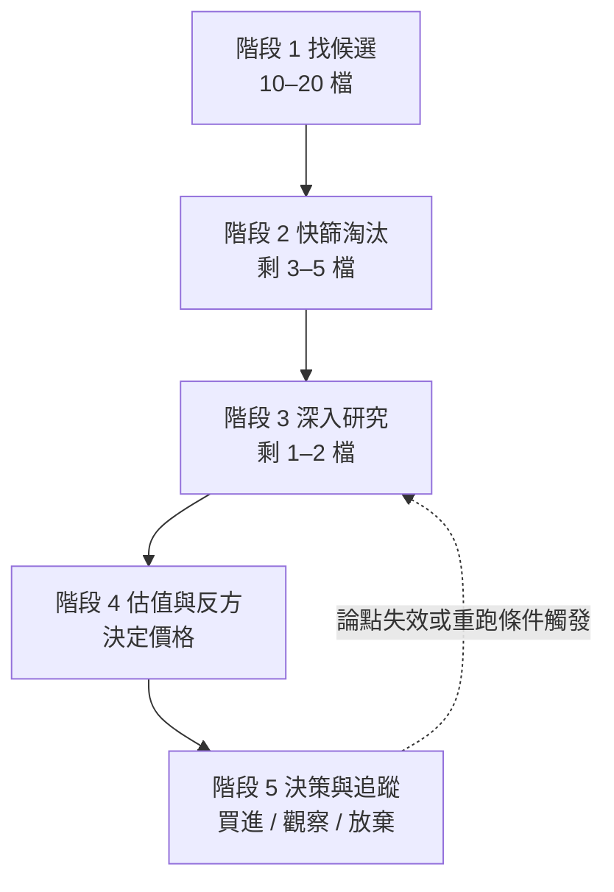

# 如何找到一家值得投資的公司：完整流程

> 彙整 00–08 所有方法論。這是一個**漏斗**：先廣撒網，再逐關淘汰，最後剩下的才值得花錢。
> 僅供學習用途，非投資建議。

| 階段 | 目的 | 每檔耗時 | 對應檔案 |
|------|------|----------|----------|
| 1 找候選 | 建立候選名單 | 1–2 小時（整批） | 08、07 §3 |
| 2 快篩淘汰 | 用硬門檻刷掉爛公司 | 15 分鐘 | checklist B、C |
| 3 深入研究 | 確認是好公司 | 3–4 小時 | 01–04 |
| 4 估值與反方 | 確認是好價格 | 1–2 小時 | 05、06 |
| 5 決策與追蹤 | 下決定、設停損條件 | 30 分鐘，之後每季 30 分鐘 | 07、08 §8 |

**原則：每一關只要不及格就淘汰，不要因為喜歡這家公司而放寬標準。**

**產出**：每檔個股報告存到 `analysis/`，格式一律依 [09-report-format.md](09-report-format.md)。

---

## 階段 0：資料紀律（每一階段都適用）

- 價格和財報數字一定要即時查，不用記憶
- 優先來源：10-K / 10-Q（台股：公開資訊觀測站年報、季報）
- 每份筆記開頭寫：資料日期、來源、可信度

→ 細節：[00-data-discipline.md](00-data-discipline.md)

---

## 階段 1：找候選（產出 10–20 檔）

三個入口，挑一個或混用：

| 入口 | 做法 | 工具 |
|------|------|------|
| **由上而下：題材** | 選一個題材 → 畫供應鏈 → 找瓶頸層與二階受益者 | `industry-map`、台股用 `discover.py` / `build_themes.py` |
| **由下而上：篩選** | 用量化條件排名一批股票 | `stock-screener`（品質 25%、估值 20%、成長 20%、動能 20%、情緒 15%） |
| **能力圈** | 工作或生活中你看得懂、看得到需求變化的公司 | 自己的觀察 |

題材入口要多做一步：用 [08 §9 熱度表](08-theme-analysis.md) 打分。🔴 ≥ 5 項就把重心從龍頭移到二階受益者。

→ 細節：[08-theme-analysis.md](08-theme-analysis.md)、[07 §3](07-scoring-and-decision.md)

---

## 階段 2：快篩淘汰（每檔 15 分鐘，剩 3–5 檔）

只看硬數字。**任一項觸發就淘汰**：

| 淘汰條件 | 原因 |
|----------|------|
| ROIC < WACC（連續 2 年以上） | 成長在毀滅價值 |
| Piotroski F-Score ≤ 3 | 財務體質在惡化 |
| CFO / 淨利 < 0.7x（連續多年） | 盈餘可能灌水 |
| Net Debt / EBITDA > 4x | 財務風險高、彈性低 |
| 會計師更換、重編、持續經營疑慮 | 財報可信度有問題 |

不在淘汰清單上、但要標記為「深入研究時重點查」：SBC > 營收 5%、應收帳款成長快於營收、商譽 > 總資產 30%、單一客戶 > 營收 10%。

→ 細節：[checklist.md](checklist.md) B、C 區

---

## 階段 3：深入研究（每檔 3–4 小時，剩 1–2 檔）

依序回答四個問題：

1. **生意好嗎？** 能說出護城河來源、寬度、趨勢。護城河綜合分數 ≥ 6。→ [01](01-business-moat.md)
2. **財務健康嗎？** ROIC − WACC 利差在擴大；ROE 靠利潤率而非槓桿；現金轉換週期穩定或下降。→ [02](02-financial-health.md)
3. **賺的錢是真的嗎？** 讀年報的 MD&A、風險因子（比較今年新增了什麼）、附註。會計品質分數 ≥ 18/21。→ [03](03-earnings-quality.md)
4. **管理層可信嗎？** 過去 8 季指引命中 ≥ 6 季、併購有紀律、內部人沒有大量賣股。資本配置分數 ≥ 7。→ [04](04-management.md)

**過關標準**：checklist 的 A–D 區大多是 ✅，而且沒有任何 C 區紅旗。

到這裡你已經知道它是不是**好公司**，但還不知道是不是**好投資**。

---

## 階段 4：估值與反方（每檔 1–2 小時）

1. **算內在價值**：至少兩種方法（DCF 三情境 + 同業比較），畫足球場圖。→ [05](05-valuation.md)
2. **算安全邊際**：依你的風格設門檻（價值型 25–35%、GARP 10–20%、成長型 0–10%）。
3. **攻擊自己的論點**：用放空者角度寫 bear case，Bear Case 強度 ≤ 4.0 才繼續。→ [06](06-risk-and-bear-case.md)
4. **算風險報酬比**：Bull 上檔 / Bear 下檔 ≥ 3:1。

**好公司但太貴 → 不要硬買，放進觀察名單，設定目標價等它。**

---

## 階段 5：決策與追蹤（30 分鐘，之後每季 30 分鐘）

### 下決定

| 綜合分數（07） | 動作 |
|----------------|------|
| ≥ 6.5 且安全邊際達標 | 買進 |
| 5.0–6.4 | 觀察名單 |
| < 5.0 | 放棄 |

部位大小：高信心 5–7%、中等 2–4%、試單 1–2%。

### 買進前寫下三樣東西

1. **論點一段話**：必須發生什麼、市場錯在哪、為什麼是現在
2. **3–5 個有門檻的 KPI**：例如「毛利率 ≥ 45%」「營收 YoY ≥ 15%」
3. **論點失效條件**：什麼情況下賣出（事件，不是感覺）

### 定期檢查

重跑時機：每次財報、股價 ±15%、滿 90 天、重大事件。

| 狀態 | 條件 | 動作 |
|------|------|------|
| INTACT | KPI 全數在門檻內 | 續抱 |
| WEAKENED | 1 個 KPI 跌破 | 不加碼、提前檢查 |
| BROKEN | 2 個以上跌破，或核心機制被證偽 | 買進理由已消失，規劃出場 |

→ 細節：[07](07-scoring-and-decision.md)、[08 §8](08-theme-analysis.md)

---

## 常見錯誤

| 錯誤 | 對應的關卡 |
|------|------------|
| 因為題材熱就買，沒檢查公司品質 | 階段 2–3 |
| 找到好公司就買，沒算價格 | 階段 4 |
| 只看多方理由 | 階段 4 bear case |
| 買了之後沒有賣出條件 | 階段 5 |
| 用記憶中的數字 | 階段 0 |
