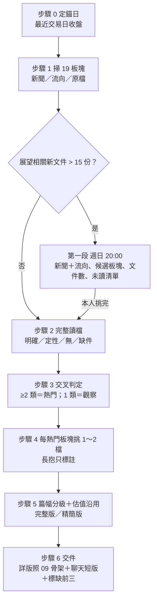

# 週投資機會：完整流程（從週日 20:00 到交件）

> 彙整 00–09。這是一個**漏斗**：19 個固定板塊 → 熱門板塊 → 每板塊 1～2 檔。
> 出處以各編號檔為準；本檔不新增規則。分析師草稿，非投資建議、不下單。

| 步驟 | 做什麼 | 產出 | 對應檔案 |
|---|---|---|---|
| 0 | 定錨日、寫休市原因；讀既定檔（清單、規格、現行 pool） | 錨日 | [00](00-data-discipline.md) §2；技能 §0 |
| 1 | 依固定清單掃 19 板塊三類訊號：新聞 5～10 日、法人 20 交易日（T86／TPEx 腳本）、近 20 交易日新文件清點 | 流向 CSV、文件清單 | [01](01-universe-and-sectors.md)、[02](02-hot-sector-signals.md) |
| 2 | 第 3 類：有新文件的代表公司讀抽出頁面、分級、寫引用；其餘沿用並標日期；展望相關文件 >15 份走兩段交件 | 引用表、索引、檢查點 | [03](03-filings-and-outlook-grading.md) |
| 3 | 板塊 × 三類訊號總表；≥2 類＝熱門、1 類＝觀察；不硬湊 | 總表 | [02](02-hot-sector-signals.md) |
| 4 | 每熱門板塊挑 1～2 檔（基本面＋題材、板塊代表＋相對優勢；不含動能）；長抱標強／條件／弱 | 入選清單 | [04](04-stock-selection-and-holding-tags.md) |
| 5 | 強寫完整版、論述弱寫精簡版（條件只加註前提）；估值沿用 brief／同週 pool 價帶 | 各檔段落 | [04](04-stock-selection-and-holding-tags.md)、[05](05-valuation-bands.md) |
| 6 | 照 09 骨架交詳版（`analysis/weekly/`）；聊天短版列全部入選每檔一行；標缺前三 | 週報 .md／聊天短版 | [07](07-delivery-and-writing.md)、[09](09-report-format.md) |
| 之後 | 本人點名 → 模式 B（含價量疊圖）；決定要買 → 才叫財務／策略 | — | [06](06-price-volume-chart.md)、[08](08-schedule-and-roles.md) |

**原則：訊號不夠就照實寫少，不降門檻；資料拿不到就標缺，不發明、不繞過防護。**

## 常見錯誤（依現行規則）

| 錯誤 | 違反的規則 |
|---|---|
| 用漲幅、成交量當熱門依據 | 02 §3 |
| 用二手報導讓第 3 類成立 | 03 §2–3 |
| 新文件超過 15 份就自己砍板塊，或把設備／廠房公告算進門檻 | 03 §6 |
| 被防護擋住就開瀏覽器補抓 | 00 §5 |
| 因為長抱論述弱就不選 | 04 §3 |
| 公司名旁寫「觀察」「不加碼」 | 00 §1 |
| 只寫本益比不給台幣價帶 | 05 §2 |
| 稿內出現資產數字或買賣命令句 | 00 §1、07 §2 |
